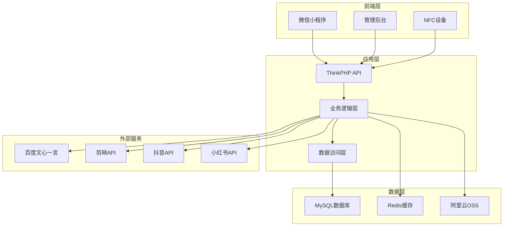
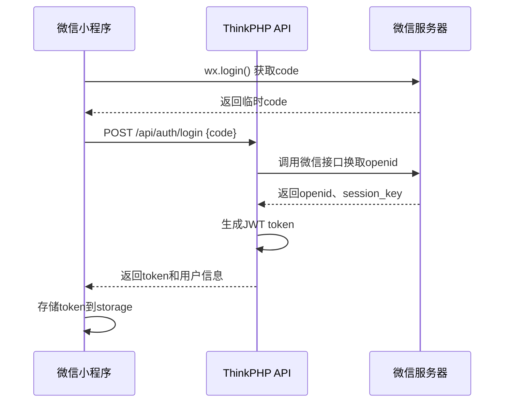

# xiaomotui - Task 49

Execute task 49 for the xiaomotui specification.

## Task Description
创建内容审核服务

## Usage
```
/Task:49-xiaomotui
```

## Instructions

Execute with @spec-task-executor agent the following task: "创建内容审核服务"

```
Use the @spec-task-executor agent to implement task 49: "创建内容审核服务" for the xiaomotui specification and include all the below context.

# Steering Context
## Steering Documents Context

No steering documents found or all are empty.

# Specification Context
## Specification Context (Pre-loaded): xiaomotui

### Requirements
# 需求文档

## 介绍

小魔推碰一碰是一款革命性的NFC智能营销内容生成平台。通过"手机NFC一碰即发"的极简操作，结合AI智能内容生成技术，为实体门店、本地生活服务商和快闪活动提供从内容创作到全平台分发的一站式营销解决方案。产品致力于打破传统内容营销的技术壁垒，让每个商家都能零门槛创作"电影级"的探店视频和营销文案，实现万物皆可"种草"的营销新生态。

## 产品愿景对标

该产品支持以下战略目标：
- **内容营销民主化**：让无技能商家也能创作专业级营销内容
- **营销效率革命**：从小时级制作缩短到秒级生成
- **全链路数字化**：打通内容创作、平台分发、转化跳转的完整链路
- **场景化营销升级**：将线下实体场景与线上传播无缝连接

## 需求说明

### 需求 1：NFC碰一碰核心引擎

**用户故事**：作为实体门店商家，我希望顾客轻触NFC设备就能自动生成探店内容，以便零成本获得专业营销素材。

#### 验收标准

1. 当用户手机碰触NFC设备时，系统应在1秒内响应并启动内容生成流程
2. 当系统检测到NFC信号时，系统应自动识别设备绑定的商家信息和营销场景
3. 当NFC连接建立时，系统应支持多种触发模式（探店视频、营销文案、活动跳转）
4. 当系统获取位置信息时，系统应自动匹配对应的门店模板和素材库
5. 如果用户首次使用，系统应提供30秒内的新手引导流程

### 需求 2：AI智能内容生成系统

**用户故事**：作为探店达人或顾客，我希望AI能够自动生成高质量的视频和文案，以便无需任何剪辑技能就能创作专业内容。

#### 验收标准

1. 当用户触发内容生成时，系统应在30秒内生成"电影级"探店视频
2. 当AI分析场景时，系统应自动识别环境、产品、氛围等关键元素
3. 当生成视频内容时，系统应支持多种风格（美食、时尚、文艺、潮流等）
4. 当创作营销文案时，系统应根据平台特色生成针对性内容（抖音短文案、小红书长图文）
5. 如果内容质量不满意，系统应支持一键重新生成（最多3次）

### 需求 3：全平台智能分发系统

**用户故事**：作为内容创作者，我希望生成的内容能一键分发到多个平台，以便最大化传播效果和营销价值。

#### 验收标准

1. 当内容生成完成时，系统应支持一键分发到抖音、小红书、微信朋友圈等主流平台
2. 当用户选择平台时，系统应自动适配各平台的内容规格和发布要求
3. 当执行分发时，系统应支持定时发布和批量发布功能
4. 当分发完成时，系统应提供各平台的发布状态和链接追踪
5. 如果某平台发布失败，系统应提供错误原因和重新发布选项

### 需求 4：场景化营销跳转系统

**用户故事**：作为商家，我希望通过碰一碰实现多种营销转化场景，以便提高客户转化率和用户粘性。

#### 验收标准

1. 当用户碰一碰时，系统应支持团购页面跳转功能
2. 当触发好友添加时，系统应自动跳转到商家企业微信或个人微信
3. 当用户需要WiFi时，系统应支持一碰连接免密WiFi功能
4. 当执行优惠券领取时，系统应自动发放到用户账户并支持核销
5. 如果用户在店内，系统应支持桌号绑定和服务呼叫功能

### 需求 5：商家运营管理后台

**用户故事**：作为商家运营人员，我希望有完善的后台管理系统，以便配置NFC设备、管理内容模板和追踪营销效果。

#### 验收标准

1. 当商家登录后台时，系统应显示NFC设备状态、内容生成量、分发效果等关键数据
2. 当配置NFC设备时，系统应支持设备绑定、场景设置、模板选择等功能
3. 当管理内容模板时，系统应支持自定义视频模板、文案模板、品牌元素等
4. 当查看数据报表时，系统应提供触发次数、生成成功率、分发效果、转化数据等分析
5. 如果设备异常，系统应及时推送告警信息和处理建议

### 需求 6：AI内容素材库管理

**用户故事**：作为系统管理员，我希望能够管理和优化AI内容生成的素材库，以便不断提升内容质量和适应性。

#### 验收标准

1. 当更新素材库时，系统应支持视频片段、音效、转场效果、文案模板的批量导入
2. 当分析内容效果时，系统应根据用户反馈和传播数据自动优化素材推荐权重
3. 当添加新场景时，系统应支持快速创建对应的素材包和生成模板
4. 当内容审核时，系统应提供自动审核和人工审核相结合的内容安全机制
5. 如果发现违规内容，系统应自动下架并通知相关商家

### 需求 7：数据分析与营销洞察

**用户故事**：作为商家决策者，我希望通过数据分析了解营销效果和用户行为，以便优化营销策略和提升ROI。

#### 验收标准

1. 当查看实时数据时，系统应显示碰一碰触发量、内容生成量、平台分发量等核心指标
2. 当分析用户行为时，系统应提供用户画像、使用时段、热门场景等深度分析
3. 当评估营销效果时，系统应计算内容传播指数、转化率、ROI等关键指标
4. 当生成营销建议时，系统应基于数据分析提供个性化的优化建议
5. 如果发现异常数据，系统应及时预警并提供可能的原因分析

## 非功能性需求

### 性能要求
- NFC响应时间不超过1秒
- AI内容生成时间不超过30秒
- 视频处理和输出时间不超过60秒
- 同时支持1000+设备并发使用

### 安全要求
- NFC通信采用AES加密
- 用户内容数据端到端加密存储
- 商家后台支持SSO单点登录
- 定期进行AI模型安全审计

### 可靠性要求
- 系统可用性达到99.5%
- NFC设备故障自动切换备用方案
- 内容生成失败自动重试机制
- 数据备份保证7天内可恢复

### 易用性要求
- NFC操作无需任何学习成本
- 内容生成全程可视化进度展示
- 支持老人和儿童友好的交互设计
- 提供24小时在线客服支持

### 兼容性要求
- 支持iOS 13+和Android 8+系统
- 兼容主流NFC芯片（NXP、高通等）
- 适配抖音、小红书、微信等平台API
- 支持4G/5G/WiFi网络环境

---

### Design
# 设计文档

## 概述

小魔推碰一碰是一个基于NFC技术的智能营销内容生成平台，通过"碰一碰"触发AI内容生成，实现从线下场景到线上传播的全链路营销转化。系统采用简化架构，重点关注功能实现和用户体验，为实体门店提供零门槛的专业营销内容创作能力。

## 技术标准对齐

### 技术栈选择
- **前端**: 微信小程序 + Vue.js管理后台
- **后端框架**: ThinkPHP 8.0
- **数据库**: MySQL 8.0
- **缓存**: Redis
- **文件存储**: 阿里云OSS
- **AI服务**:
  - 文案生成：百度文心一言 / 讯飞星火
  - 视频生成：剪映API / 腾讯智影
- **第三方集成**: 微信支付、抖音开放平台、小红书API

### 项目结构规范
```
xiaomotui/
├── api/                     # ThinkPHP后端API
│   ├── app/
│   │   ├── controller/      # 控制器
│   │   ├── model/          # 模型
│   │   ├── service/        # 业务逻辑层
│   │   └── validate/       # 数据验证
│   ├── config/             # 配置文件
│   ├── route/              # 路由配置
│   └── database/           # 数据库迁移文件
├── miniprogram/            # 微信小程序
│   ├── pages/              # 页面
│   ├── components/         # 组件
│   └── utils/              # 工具函数
├── admin/                  # Vue.js管理后台
│   ├── src/
│   │   ├── views/          # 页面组件
│   │   ├── components/     # 通用组件
│   │   └── api/            # API调用
│   └── public/
└── database/
    └── migrations/         # 数据库迁移脚本
```

## 数据库设计

### 用户相关表

#### 用户表 (users)
```sql
CREATE TABLE `users` (
  `id` int(11) unsigned NOT NULL AUTO_INCREMENT COMMENT '用户ID',
  `openid` varchar(64) NOT NULL COMMENT '微信openid',
  `unionid` varchar(64) DEFAULT NULL COMMENT '微信unionid',
  `phone` varchar(20) DEFAULT NULL COMMENT '手机号',
  `nickname` varchar(50) DEFAULT NULL COMMENT '昵称',
  `avatar` varchar(255) DEFAULT NULL COMMENT '头像',
  `gender` tinyint(1) DEFAULT '0' COMMENT '性别 0未知 1男 2女',
  `member_level` enum('BASIC','VIP','PREMIUM') DEFAULT 'BASIC' COMMENT '会员等级',
  `points` int(11) DEFAULT '0' COMMENT '积分',
  `status` tinyint(1) DEFAULT '1' COMMENT '状态 0禁用 1正常',
  `last_login_time` datetime DEFAULT NULL COMMENT '最后登录时间',
  `create_time` datetime NOT NULL COMMENT '创建时间',
  `update_time` datetime NOT NULL COMMENT '更新时间',
  PRIMARY KEY (`id`),
  UNIQUE KEY `openid` (`openid`),
  KEY `phone` (`phone`)
) ENGINE=InnoDB DEFAULT CHARSET=utf8mb4 COMMENT='用户表';
```

#### 商家表 (merchants)
```sql
CREATE TABLE `merchants` (
  `id` int(11) unsigned NOT NULL AUTO_INCREMENT COMMENT '商家ID',
  `user_id` int(11) unsigned NOT NULL COMMENT '关联用户ID',
  `name` varchar(100) NOT NULL COMMENT '商家名称',
  `category` varchar(50) NOT NULL COMMENT '商家类别',
  `address` varchar(255) NOT NULL COMMENT '地址',
  `longitude` decimal(10,7) DEFAULT NULL COMMENT '经度',
  `latitude` decimal(10,7) DEFAULT NULL COMMENT '纬度',
  `phone` varchar(20) DEFAULT NULL COMMENT '联系电话',
  `description` text COMMENT '商家描述',
  `logo` varchar(255) DEFAULT NULL COMMENT '商家logo',
  `business_hours` json DEFAULT NULL COMMENT '营业时间',
  `status` tinyint(1) DEFAULT '1' COMMENT '状态 0禁用 1正常 2审核中',
  `create_time` datetime NOT NULL COMMENT '创建时间',
  `update_time` datetime NOT NULL COMMENT '更新时间',
  PRIMARY KEY (`id`),
  KEY `user_id` (`user_id`),
  KEY `category` (`category`)
) ENGINE=InnoDB DEFAULT CHARSET=utf8mb4 COMMENT='商家表';
```

### NFC设备相关表

#### NFC设备表 (nfc_devices)
```sql
CREATE TABLE `nfc_devices` (
  `id` int(11) unsigned NOT NULL AUTO_INCREMENT COMMENT '设备ID',
  `merchant_id` int(11) unsigned NOT NULL COMMENT '所属商家ID',
  `device_code` varchar(32) NOT NULL COMMENT '设备编码',
  `device_name` varchar(100) NOT NULL COMMENT '设备名称',
  `location` varchar(100) DEFAULT NULL COMMENT '设备位置',
  `type` enum('TABLE','WALL','COUNTER','ENTRANCE') DEFAULT 'TABLE' COMMENT '设备类型',
  `trigger_mode` enum('VIDEO','COUPON','WIFI','CONTACT','MENU') DEFAULT 'VIDEO' COMMENT '触发模式',
  `template_id` int(11) DEFAULT NULL COMMENT '内容模板ID',
  `redirect_url` varchar(255) DEFAULT NULL COMMENT '跳转链接',
  `wifi_ssid` varchar(50) DEFAULT NULL COMMENT 'WiFi名称',
  `wifi_password` varchar(50) DEFAULT NULL COMMENT 'WiFi密码',
  `status` tinyint(1) DEFAULT '1' COMMENT '状态 0离线 1在线 2维护',
  `battery_level` tinyint(3) DEFAULT NULL COMMENT '电池电量',
  `last_heartbeat` datetime DEFAULT NULL COMMENT '最后心跳时间',
  `create_time` datetime NOT NULL COMMENT '创建时间',
  `update_time` datetime NOT NULL COMMENT '更新时间',
  PRIMARY KEY (`id`),
  UNIQUE KEY `device_code` (`device_code`),
  KEY `merchant_id` (`merchant_id`)
) ENGINE=InnoDB DEFAULT CHARSET=utf8mb4 COMMENT='NFC设备表';
```

### 内容生成相关表

#### 内容模板表 (content_templates)
```sql
CREATE TABLE `content_templates` (
  `id` int(11) unsigned NOT NULL AUTO_INCREMENT COMMENT '模板ID',
  `merchant_id` int(11) unsigned DEFAULT NULL COMMENT '商家ID 为空表示系统模板',
  `name` varchar(100) NOT NULL COMMENT '模板名称',
  `type` enum('VIDEO','TEXT','IMAGE') NOT NULL COMMENT '模板类型',
  `category` varchar(50) NOT NULL COMMENT '模板分类',
  `style` varchar(50) DEFAULT NULL COMMENT '风格标签',
  `content` json NOT NULL COMMENT '模板内容配置',
  `preview_url` varchar(255) DEFAULT NULL COMMENT '预览图',
  `usage_count` int(11) DEFAULT '0' COMMENT '使用次数',
  `is_public` tinyint(1) DEFAULT '0' COMMENT '是否公开 0私有 1公开',
  `status` tinyint(1) DEFAULT '1' COMMENT '状态 0禁用 1启用',
  `create_time` datetime NOT NULL COMMENT '创建时间',
  `update_time` datetime NOT NULL COMMENT '更新时间',
  PRIMARY KEY (`id`),
  KEY `merchant_id` (`merchant_id`),
  KEY `category` (`category`)
) ENGINE=InnoDB DEFAULT CHARSET=utf8mb4 COMMENT='内容模板表';
```

#### 内容生成任务表 (content_tasks)
```sql
CREATE TABLE `content_tasks` (
  `id` int(11) unsigned NOT NULL AUTO_INCREMENT COMMENT '任务ID',
  `user_id` int(11) unsigned NOT NULL COMMENT '用户ID',
  `merchant_id` int(11) unsigned NOT NULL COMMENT '商家ID',
  `device_id` int(11) unsigned DEFAULT NULL COMMENT '设备ID',
  `template_id` int(11) unsigned DEFAULT NULL COMMENT '模板ID',
  `type` enum('VIDEO','TEXT','IMAGE') NOT NULL COMMENT '内容类型',
  `status` enum('PENDING','PROCESSING','COMPLETED','FAILED') DEFAULT 'PENDING' COMMENT '任务状态',
  `input_data` json DEFAULT NULL COMMENT '输入数据',
  `output_data` json DEFAULT NULL COMMENT '输出数据',
  `ai_provider` varchar(20) DEFAULT NULL COMMENT 'AI服务商',
  `generation_time` int(11) DEFAULT NULL COMMENT '生成耗时(秒)',
  `error_message` text COMMENT '错误信息',
  `create_time` datetime NOT NULL COMMENT '创建时间',
  `update_time` datetime NOT NULL COMMENT '更新时间',
  `complete_time` datetime DEFAULT NULL COMMENT '完成时间',
  PRIMARY KEY (`id`),
  KEY `user_id` (`user_id`),
  KEY `merchant_id` (`merchant_id`),
  KEY `device_id` (`device_id`),
  KEY `status` (`status`)
) ENGINE=InnoDB DEFAULT CHARSET=utf8mb4 COMMENT='内容生成任务表';
```

### 平台分发相关表

#### 发布任务表 (publish_tasks)
```sql
CREATE TABLE `publish_tasks` (
  `id` int(11) unsigned NOT NULL AUTO_INCREMENT COMMENT '发布任务ID',
  `content_task_id` int(11) unsigned NOT NULL COMMENT '内容任务ID',
  `user_id` int(11) unsigned NOT NULL COMMENT '用户ID',
  `platforms` json NOT NULL COMMENT '发布平台配置',
  `status` enum('PENDING','PUBLISHING','COMPLETED','PARTIAL','FAILED') DEFAULT 'PENDING' COMMENT '发布状态',
  `results` json DEFAULT NULL COMMENT '发布结果',
  `scheduled_time` datetime DEFAULT NULL COMMENT '定时发布时间',
  `publish_time` datetime DEFAULT NULL COMMENT '实际发布时间',
  `create_time` datetime NOT NULL COMMENT '创建时间',
  `update_time` datetime NOT NULL COMMENT '更新时间',
  PRIMARY KEY (`id`),
  KEY `content_task_id` (`content_task_id`),
  KEY `user_id` (`user_id`),
  KEY `status` (`status`)
) ENGINE=InnoDB DEFAULT CHARSET=utf8mb4 COMMENT='发布任务表';
```

#### 平台账号表 (platform_accounts)
```sql
CREATE TABLE `platform_accounts` (
  `id` int(11) unsigned NOT NULL AUTO_INCREMENT COMMENT '账号ID',
  `user_id` int(11) unsigned NOT NULL COMMENT '用户ID',
  `platform` enum('DOUYIN','XIAOHONGSHU','WECHAT','WEIBO') NOT NULL COMMENT '平台类型',
  `platform_uid` varchar(100) NOT NULL COMMENT '平台用户ID',
  `platform_name` varchar(100) DEFAULT NULL COMMENT '平台昵称',
  `access_token` text COMMENT '访问令牌',
  `refresh_token` text COMMENT '刷新令牌',
  `expires_time` datetime DEFAULT NULL COMMENT '令牌过期时间',
  `avatar` varchar(255) DEFAULT NULL COMMENT '头像',
  `follower_count` int(11) DEFAULT '0' COMMENT '粉丝数',
  `status` tinyint(1) DEFAULT '1' COMMENT '状态 0失效 1正常',
  `create_time` datetime NOT NULL COMMENT '创建时间',
  `update_time` datetime NOT NULL COMMENT '更新时间',
  PRIMARY KEY (`id`),
  KEY `user_id` (`user_id`),
  KEY `platform` (`platform`)
) ENGINE=InnoDB DEFAULT CHARSET=utf8mb4 COMMENT='平台账号表';
```

### 营销活动相关表

#### 优惠券表 (coupons)
```sql
CREATE TABLE `coupons` (
  `id` int(11) unsigned NOT NULL AUTO_INCREMENT COMMENT '优惠券ID',
  `merchant_id` int(11) unsigned NOT NULL COMMENT '商家ID',
  `name` varchar(100) NOT NULL COMMENT '优惠券名称',
  `type` enum('DISCOUNT','FULL_REDUCE','FREE_SHIPPING') NOT NULL COMMENT '优惠券类型',
  `value` decimal(10,2) NOT NULL COMMENT '优惠金额',
  `min_amount` decimal(10,2) DEFAULT '0.00' COMMENT '最低消费金额',
  `total_count` int(11) NOT NULL COMMENT '总发放数量',
  `used_count` int(11) DEFAULT '0' COMMENT '已使用数量',
  `per_user_limit` int(11) DEFAULT '1' COMMENT '每人限领数量',
  `valid_days` int(11) DEFAULT '30' COMMENT '有效天数',
  `start_time` datetime NOT NULL COMMENT '开始时间',
  `end_time` datetime NOT NULL COMMENT '结束时间',
  `status` tinyint(1) DEFAULT '1' COMMENT '状态 0禁用 1启用',
  `create_time` datetime NOT NULL COMMENT '创建时间',
  `update_time` datetime NOT NULL COMMENT '更新时间',
  PRIMARY KEY (`id`),
  KEY `merchant_id` (`merchant_id`)
) ENGINE=InnoDB DEFAULT CHARSET=utf8mb4 COMMENT='优惠券表';
```

#### 用户优惠券表 (user_coupons)
```sql
CREATE TABLE `user_coupons` (
  `id` int(11) unsigned NOT NULL AUTO_INCREMENT COMMENT 'ID',
  `user_id` int(11) unsigned NOT NULL COMMENT '用户ID',
  `coupon_id` int(11) unsigned NOT NULL COMMENT '优惠券ID',
  `code` varchar(32) NOT NULL COMMENT '优惠券码',
  `status` enum('UNUSED','USED','EXPIRED') DEFAULT 'UNUSED' COMMENT '使用状态',
  `source` varchar(50) DEFAULT NULL COMMENT '获取来源',
  `get_time` datetime NOT NULL COMMENT '获取时间',
  `use_time` datetime DEFAULT NULL COMMENT '使用时间',
  `expire_time` datetime NOT NULL COMMENT '过期时间',
  PRIMARY KEY (`id`),
  UNIQUE KEY `code` (`code`),
  KEY `user_id` (`user_id`),
  KEY `coupon_id` (`coupon_id`)
) ENGINE=InnoDB DEFAULT CHARSET=utf8mb4 COMMENT='用户优惠券表';
```

### 数据统计相关表

#### 设备触发记录表 (device_triggers)
```sql
CREATE TABLE `device_triggers` (
  `id` int(11) unsigned NOT NULL AUTO_INCREMENT COMMENT '记录ID',
  `device_id` int(11) unsigned NOT NULL COMMENT '设备ID',
  `user_id` int(11) unsigned DEFAULT NULL COMMENT '用户ID',
  `trigger_type` varchar(20) NOT NULL COMMENT '触发类型',
  `ip_address` varchar(45) DEFAULT NULL COMMENT 'IP地址',
  `user_agent` varchar(255) DEFAULT NULL COMMENT '用户代理',
  `result` enum('SUCCESS','FAILED') DEFAULT 'SUCCESS' COMMENT '触发结果',
  `response_time` int(11) DEFAULT NULL COMMENT '响应时间(毫秒)',
  `create_time` datetime NOT NULL COMMENT '创建时间',
  PRIMARY KEY (`id`),
  KEY `device_id` (`device_id`),
  KEY `user_id` (`user_id`),
  KEY `create_time` (`create_time`)
) ENGINE=InnoDB DEFAULT CHARSET=utf8mb4 COMMENT='设备触发记录表';
```

#### 数据统计表 (statistics)
```sql
CREATE TABLE `statistics` (
  `id` int(11) unsigned NOT NULL AUTO_INCREMENT COMMENT '统计ID',
  `merchant_id` int(11) unsigned DEFAULT NULL COMMENT '商家ID',
  `date` date NOT NULL COMMENT '统计日期',
  `metric_type` varchar(50) NOT NULL COMMENT '指标类型',
  `metric_value` decimal(15,2) NOT NULL COMMENT '指标数值',
  `extra_data` json DEFAULT NULL COMMENT '额外数据',
  `create_time` datetime NOT NULL COMMENT '创建时间',
  PRIMARY KEY (`id`),
  KEY `merchant_id` (`merchant_id`),
  KEY `date` (`date`),
  KEY `metric_type` (`metric_type`)
) ENGINE=InnoDB DEFAULT CHARSET=utf8mb4 COMMENT='数据统计表';
```

## 架构设计

采用经典的MVC三层架构，简单实用：



## 认证系统设计

### 微信小程序认证流程

#### 登录时序图


#### JWT Token设计
```php
// JWT载荷结构
{
    "iss": "xiaomotui",           // 签发者
    "aud": "miniprogram",         // 接收者
    "iat": 1640995200,            // 签发时间
    "exp": 1641081600,            // 过期时间(24小时)
    "sub": "user_12345",          // 用户ID
    "openid": "wx_openid_123",    // 微信openid
    "role": "user",               // 用户角色 user/merchant/admin
    "merchant_id": 123            // 商家ID(可选)
}
```

### 权限控制系统

#### 角色权限定义
```php
// 权限配置
const PERMISSIONS = [
    'user' => [
        'nfc.trigger',           // NFC触发
        'content.generate',      // 内容生成
        'content.view',          // 查看内容
        'publish.own'            // 发布自己的内容
    ],
    'merchant' => [
        'device.manage',         // 设备管理
        'template.manage',       // 模板管理
        'coupon.manage',         // 优惠券管理
        'statistics.view'        // 数据统计
    ],
    'admin' => [
        'system.manage',         // 系统管理
        'user.manage',           // 用户管理
        'merchant.audit'         // 商家审核
    ]
];
```

## API接口规范

### 统一响应格式

#### 成功响应
```json
{
    "code": 200,
    "message": "success",
    "data": {
        // 具体数据
    },
    "timestamp": 1640995200
}
```

#### 错误响应
```json
{
    "code": 400,
    "message": "参数错误",
    "error": "validation_failed",
    "errors": {
        "phone": ["手机号格式不正确"]
    },
    "timestamp": 1640995200
}
```

#### 分页响应
```json
{
    "code": 200,
    "message": "success",
    "data": {
        "list": [],
        "pagination": {
            "current_page": 1,
            "per_page": 20,
            "total": 100,
            "last_page": 5
        }
    },
    "timestamp": 1640995200
}
```

### HTTP状态码规范

```php
const HTTP_CODES = [
    200 => '请求成功',
    201 => '创建成功',
    400 => '请求参数错误',
    401 => '未授权',
    403 => '权限不足',
    404 => '资源不存在',
    422 => '数据验证失败',
    429 => '请求频率超限',
    500 => '服务器内部错误'
];
```

## 组件和接口设计

### 认证相关接口

#### 用户认证控制器 (AuthController)
```php
class AuthController extends BaseController
{
    /**
     * 微信登录
     * POST /api/auth/login
     */
    public function login()
    {
        // 请求参数
        {
            "code": "wx_code_123",      // 微信临时code
            "encrypted_data": "",       // 加密数据(可选)
            "iv": ""                    // 初始向量(可选)
        }

        // 响应数据
        {
            "token": "jwt_token_string",
            "expires_in": 86400,
            "user": {
                "id": 123,
                "openid": "wx_openid_123",
                "nickname": "用户昵称",
                "avatar": "头像URL",
                "member_level": "BASIC"
            }
        }
    }

    /**
     * 刷新Token
     * POST /api/auth/refresh
     */
    public function refresh()
    {
        // 请求头: Authorization: Bearer old_token

        // 响应数据
        {
            "token": "new_jwt_token",
            "expires_in": 86400
        }
    }

    /**
     * 退出登录
     * POST /api/auth/logout
     */
    public function logout()
    {
        // 请求头: Authorization: Bearer token

        // 响应: 仅返回状态码200
    }
}
```

### NFC设备相关接口

#### NFC控制器 (NfcController)
```php
class NfcController extends BaseController
{
    /**
     * NFC设备触发
     * POST /api/nfc/trigger
     */
    public function trigger()
    {
        // 请求参数
        {
            "device_code": "NFC001",    // 设备编码
            "user_location": {          // 用户位置(可选)
                "latitude": 39.9042,
                "longitude": 116.4074
            },
            "extra_data": {}            // 额外数据
        }

        // 响应数据
        {
            "trigger_id": "trigger_123",
            "action": "generate_content",
            "redirect_url": "",
            "content_task_id": 456,
            "message": "内容生成任务已创建"
        }
    }

    /**
     * 设备状态上报
     * POST /api/nfc/device/status
     */
    public function deviceStatus()
    {
        // 请求参数
        {
            "device_code": "NFC001",
            "battery_level": 85,
            "signal_strength": -45,
            "last_trigger_time": "2024-01-01 12:00:00"
        }
    }

    /**
     * 获取设备配置
     * GET /api/nfc/device/{device_code}/config
     */
    public function getConfig($deviceCode)
    {
        // 响应数据
        {
            "device_info": {
                "id": 123,
                "device_code": "NFC001",
                "device_name": "前台设备",
                "trigger_mode": "VIDEO",
                "template_id": 456
            },
            "merchant_info": {
                "name": "咖啡店",
                "category": "餐饮",
                "logo": "logo_url"
            }
        }
    }
}
```

### 内容生成相关接口

#### 内容控制器 (ContentController)
```php
class ContentController extends BaseController
{
    /**
     * 创建内容生成任务
     * POST /api/content/generate
     */
    public function generate()
    {
        // 请求参数
        {
            "type": "VIDEO",            // VIDEO/TEXT/IMAGE
            "template_id": 123,         // 模板ID(可选)
            "merchant_id": 456,         // 商家ID
            "device_id": 789,           // 设备ID(可选)
            "input_data": {
                "scene": "咖啡店",
                "style": "温馨",
                "requirements": "突出环境氛围"
            }
        }

        // 响应数据
        {
            "task_id": 123,
            "status": "PENDING",
            "estimated_time": 30,
            "message": "任务已创建，预计30秒完成"
        }
    }

    /**
     * 查询任务状态
     * GET /api/content/task/{task_id}/status
     */
    public function taskStatus($taskId)
    {
        // 响应数据
        {
            "task_id": 123,
            "status": "COMPLETED",      // PENDING/PROCESSING/COMPLETED/FAILED
            "progress": 100,
            "result": {
                "video_url": "https://xxx.mp4",
                "text": "生成的文案内容",
                "duration": 15,
                "file_size": 2048000
            },
            "generation_time": 25
        }
    }

    /**
     * 获取模板列表
     * GET /api/content/templates
     */
    public function templates()
    {
        // 查询参数
        // ?type=VIDEO&category=餐饮&page=1&limit=20

        // 响应数据
        {
            "list": [
                {
                    "id": 123,
                    "name": "温馨咖啡店模板",
                    "type": "VIDEO",
                    "category": "餐饮",
                    "preview_url": "preview.jpg",
                    "usage_count": 156
                }
            ],
            "pagination": {
                "current_page": 1,
                "per_page": 20,
                "total": 50,
                "last_page": 3
            }
        }
    }
}
```

### 平台发布相关接口

#### 发布控制器 (PublishController)
```php
class PublishController extends BaseController
{
    /**
     * 发布内容到平台
     * POST /api/publish
     */
    public function publish()
    {
        // 请求参数
        {
            "content_task_id": 123,     // 内容任务ID
            "platforms": [
                {
                    "platform": "DOUYIN",
                    "account_id": 456,
                    "config": {
                        "title": "自定义标题",
                        "tags": ["咖啡", "探店"]
                    }
                }
            ],
            "scheduled_time": "2024-01-01 18:00:00"  // 定时发布(可选)
        }

        // 响应数据
        {
            "publish_task_id": 789,
            "status": "PENDING",
            "platforms_count": 1,
            "message": "发布任务已创建"
        }
    }

    /**
     * 平台授权
     * GET /api/publish/platform/{platform}/auth
     */
    public function platformAuth($platform)
    {
        // 响应数据
        {
            "auth_url": "https://platform.com/oauth/authorize?xxx",
            "state": "random_state_string"
        }
    }

    /**
     * 平台授权回调
     * POST /api/publish/platform/{platform}/callback
     */
    public function authCallback($platform)
    {
        // 请求参数
        {
            "code": "platform_auth_code",
            "state": "random_state_string"
        }

        // 响应数据
        {
            "account_info": {
                "platform_uid": "douyin_123",
                "platform_name": "用户昵称",
                "avatar": "头像URL",
                "follower_count": 1000
            }
        }
    }
}
```

### 服务层设计

#### AI内容服务 (AiContentService)
```php
class AiContentService
{
    public function generateVideo($params) {
        // 调用剪映API生成视频
    }

    public function generateText($params) {
        // 调用文心一言生成文案
    }

    public function processTemplate($templateId, $data) {
        // 处理模板生成
    }
}
```

#### 平台发布服务 (PublishService)
```php
class PublishService
{
    public function publishToDouyin($content, $account) {
        // 发布到抖音
    }

    public function publishToXiaohongshu($content, $account) {
        // 发布到小红书
    }

    public function schedulePublish($taskId, $time) {
        // 定时发布
    }
}
```

## 错误处理策略

### 常见错误场景

1. **NFC设备离线**: 记录日志，推送告警给商家
2. **AI生成失败**: 降级使用模板，重试3次
3. **平台发布失败**: 记录错误原因，支持手动重试
4. **网络超时**: 设置合理超时时间，提供友好错误提示

## 测试策略

### 功能测试
- **API接口测试**: 使用Postman测试所有接口
- **数据库测试**: 验证数据完整性和一致性
- **业务流程测试**: 完整的用户使用流程测试

### 性能测试
- **并发测试**: 使用ab或wrk进行压力测试
- **数据库优化**: 添加必要的索引和查询优化

这个设计更加实用和简单，使用ThinkPHP框架便于快速开发，重点关注功能实现而不是复杂的架构设计。

**Note**: Specification documents have been pre-loaded. Do not use get-content to fetch them again.

## Task Details
- Task ID: 49
- Description: 创建内容审核服务

## Instructions
- Implement ONLY task 49: "创建内容审核服务"
- Follow all project conventions and leverage existing code
- Mark the task as complete using: claude-code-spec-workflow get-tasks xiaomotui 49 --mode complete
- Provide a completion summary
```

## Task Completion
When the task is complete, mark it as done:
```bash
claude-code-spec-workflow get-tasks xiaomotui 49 --mode complete
```

## Next Steps
After task completion, you can:
- Execute the next task using /xiaomotui-task-[next-id]
- Check overall progress with /spec-status xiaomotui
