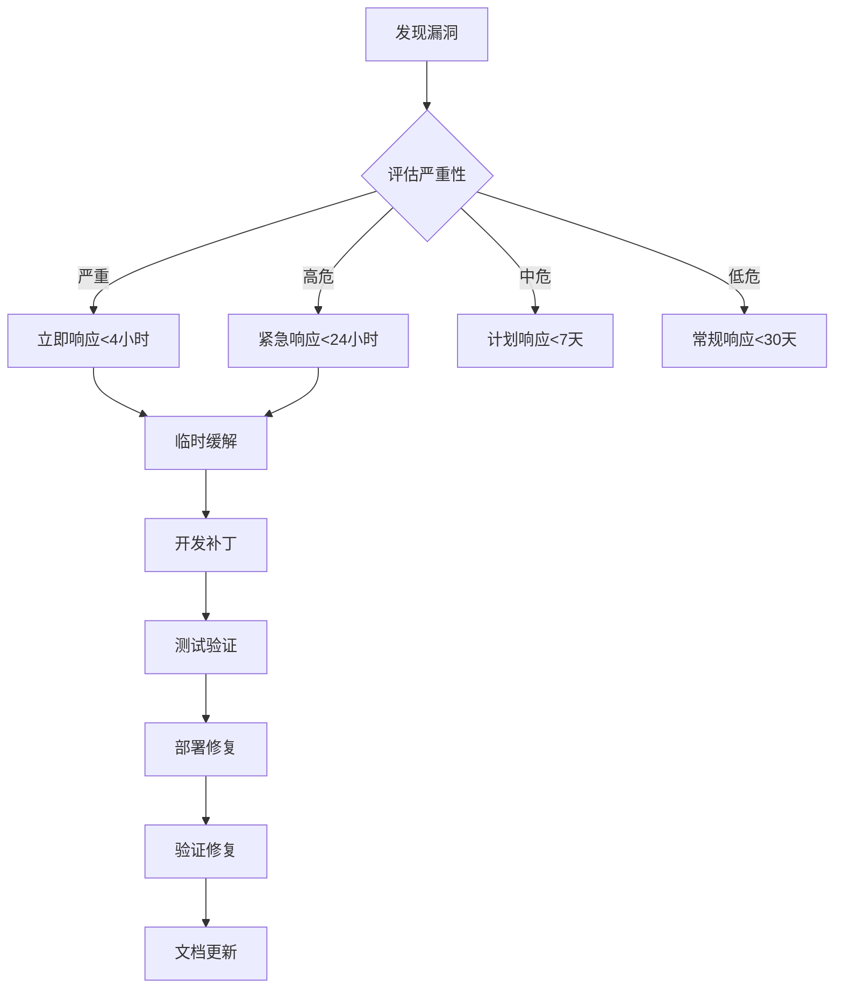
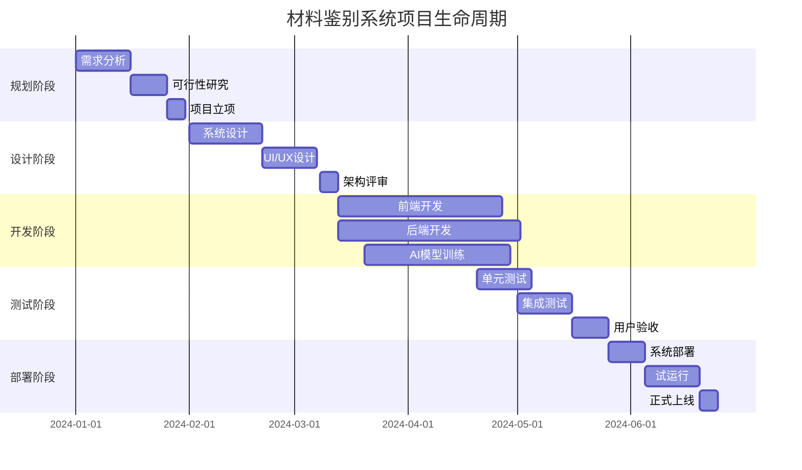
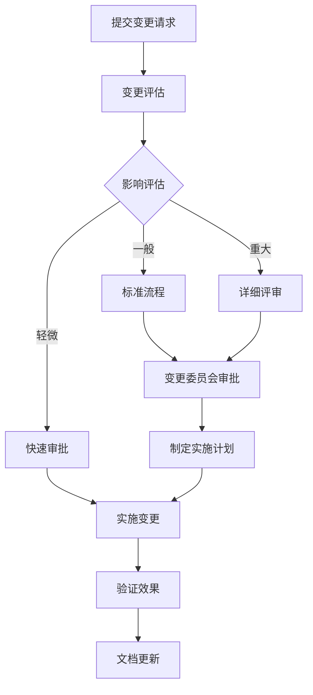
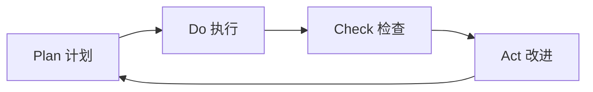

# 材料鉴别系统项目管理文档（第31-60页）

---

## 第31页

### 4. 运维文档体系

#### 4.1 系统运维手册

**4.1.1 日常运维检查清单**

**每日检查项目：**
- [ ] 系统服务状态检查
  - API服务状态：http://api.xiaomotui.com/health
  - 数据库连接状态
  - Redis缓存服务状态
  - 文件存储服务状态

- [ ] 系统资源监控
  - CPU使用率 < 80%
  - 内存使用率 < 85%
  - 磁盘空间使用率 < 90%
  - 网络延迟 < 100ms

- [ ] 业务指标监控
  - 材料鉴别成功率 > 99%
  - API响应时间 < 2秒
  - 错误率 < 0.1%
  - 并发用户数监控

**每周检查项目：**
- [ ] 数据备份完整性验证
- [ ] 系统日志分析
- [ ] 安全扫描执行
- [ ] 性能瓶颈分析
- [ ] 用户反馈汇总

**每月检查项目：**
- [ ] 容量规划评估
- [ ] 灾难恢复演练
- [ ] 安全补丁更新
- [ ] 文档更新维护
- [ ] 运维流程优化

---

## 第32页

#### 4.1.2 系统监控配置

**监控指标体系：**

```yaml
# 基础设施监控
infrastructure:
  metrics:
    - cpu_usage
    - memory_usage
    - disk_usage
    - network_io
    - system_load

  thresholds:
    cpu_usage:
      warning: 70
      critical: 85
    memory_usage:
      warning: 75
      critical: 90
    disk_usage:
      warning: 80
      critical: 95

# 应用服务监控
application:
  metrics:
    - response_time
    - throughput
    - error_rate
    - concurrent_users
    - queue_length

  sla:
    availability: 99.9
    response_time_p95: 2000ms
    error_rate: 0.1%

# 业务指标监控
business:
  metrics:
    - identification_success_rate
    - material_process_count
    - user_satisfaction_score
    - ai_accuracy_rate
```

**告警规则配置：**

```json
{
  "alert_rules": [
    {
      "name": "服务不可用",
      "condition": "up == 0",
      "duration": "30s",
      "severity": "critical",
      "action": "immediate_notification"
    },
    {
      "name": "响应时间过长",
      "condition": "http_request_duration_seconds > 3",
      "duration": "5m",
      "severity": "warning",
      "action": "notification"
    },
    {
      "name": "鉴别成功率下降",
      "condition": "identification_success_rate < 95",
      "duration": "10m",
      "severity": "warning",
      "action": "notification"
    }
  ]
}
```

---

## 第33页

#### 4.1.3 备份和恢复策略

**数据备份方案：**

| 备份类型 | 频率 | 保留期 | 存储位置 | RTO | RPO |
|---------|------|--------|----------|-----|-----|
| 完全备份 | 每周 | 4周 | 本地+云端 | 4小时 | 24小时 |
| 增量备份 | 每日 | 7天 | 本地+云端 | 2小时 | 1小时 |
| 日志备份 | 实时 | 30天 | 云端 | 1小时 | 15分钟 |
| 配置备份 | 按需 | 永久 | Git仓库 | 30分钟 | 0 |

**备份执行脚本示例：**

```bash
#!/bin/bash
# 数据库备份脚本
DATE=$(date +%Y%m%d_%H%M%S)
BACKUP_DIR="/backup/database"
DB_NAME="xiaomotui_material"

# 创建备份目录
mkdir -p $BACKUP_DIR/$DATE

# 执行备份
mysqldump -u backup_user -p$BACKUP_PASS \
  --single-transaction \
  --routines \
  --triggers \
  $DB_NAME > $BACKUP_DIR/$DATE/$DB_NAME.sql

# 压缩备份文件
gzip $BACKUP_DIR/$DATE/$DB_NAME.sql

# 上传到云存储
aws s3 cp $BACKUP_DIR/$DATE/$DB_NAME.sql.gz \
  s3://xiaomotui-backups/database/

# 清理旧备份
find $BACKUP_DIR -type d -mtime +7 -exec rm -rf {} \;
```

**恢复流程：**

1. **评估恢复需求**
   - 确定恢复时间点
   - 评估数据丢失范围
   - 选择合适备份版本

2. **准备恢复环境**
   ```bash
   # 停止应用服务
   systemctl stop xiaomotui-api

   # 创建恢复目录
   mkdir -p /restore/$DATE
   cd /restore/$DATE
   ```

3. **执行恢复操作**
   ```bash
   # 下载备份文件
   aws s3 cp s3://xiaomotui-backups/database/$DB_NAME.sql.gz .

   # 解压备份
   gunzip $DB_NAME.sql.gz

   # 恢复数据库
   mysql -u root -p $DB_NAME < $DB_NAME.sql
   ```

---

## 第34页

#### 4.1.4 故障应急预案

**故障分级标准：**

| 故障级别 | 影响范围 | 响应时间 | 解决时间 | 升级条件 |
|---------|----------|----------|----------|----------|
| P0-严重 | 全系统瘫痪 | 5分钟 | 2小时 | 30分钟未解决 |
| P1-高 | 核心功能不可用 | 15分钟 | 4小时 | 1小时未解决 |
| P2-中 | 部分功能异常 | 30分钟 | 8小时 | 2小时未解决 |
| P3-低 | 性能下降 | 1小时 | 24小时 | 4小时未解决 |

**常见故障处理流程：**

**1. 数据库连接故障**
```bash
# 故障排查步骤
# 1. 检查数据库服务状态
systemctl status mysql

# 2. 检查连接数
SHOW PROCESSLIST;

# 3. 检查慢查询
SHOW FULL PROCESSLIST;

# 4. 优化配置
SET GLOBAL max_connections = 1000;
SET GLOBAL wait_timeout = 300;

# 5. 重启服务
systemctl restart mysql
```

**2. Redis缓存故障**
```bash
# 检查Redis状态
redis-cli ping

# 检查内存使用
redis-cli info memory

# 清理过期键
redis-cli --scan --pattern "*" | xargs redis-cli del

# 重启Redis
systemctl restart redis
```

**3. 文件存储故障**
```bash
# 检查磁盘空间
df -h

# 清理临时文件
find /tmp -type f -mtime +7 -delete

# 检查NFS挂载
mount | grep nfs
```

---

## 第35页

#### 4.2 安全运维管理

**4.2.1 安全基线配置**

**操作系统安全配置：**

```bash
# 系统加固脚本
#!/bin/bash

# 更新系统
yum update -y

# 禁用不必要的服务
systemctl disable telnet
systemctl disable rsh
systemctl disable rlogin

# 配置防火墙
firewall-cmd --permanent --remove-service=telnet
firewall-cmd --permanent --remove-service=rsh
firewall-cmd --reload

# 设置密码策略
sed -i 's/PASS_MAX_DAYS.*/PASS_MAX_DAYS 90/' /etc/login.defs
sed -i 's/PASS_MIN_DAYS.*/PASS_MIN_DAYS 1/' /etc/login.defs
sed -i 's/PASS_WARN_AGE.*/PASS_WARN_AGE 7/' /etc/login.defs

# 配置SSH安全
sed -i 's/#PermitRootLogin.*/PermitRootLogin no/' /etc/ssh/sshd_config
sed -i 's/#PasswordAuthentication.*/PasswordAuthentication no/' /etc/ssh/sshd_config
systemctl restart sshd
```

**Web应用安全配置：**

```nginx
# Nginx安全配置
server {
    # 隐藏版本信息
    server_tokens off;

    # 安全头设置
    add_header X-Frame-Options DENY;
    add_header X-Content-Type-Options nosniff;
    add_header X-XSS-Protection "1; mode=block";
    add_header Strict-Transport-Security "max-age=31536000";

    # 限制请求大小
    client_max_body_size 10M;

    # 防止DDoS
    limit_req_zone $binary_remote_addr zone=api:10m rate=10r/s;
    limit_req zone=api burst=20 nodelay;
}
```

---

## 第36页

#### 4.2.2 漏洞管理流程

**漏洞扫描计划：**

```yaml
scan_schedule:
  daily:
    - web_application_scan
    - port_scan

  weekly:
    - vulnerability_assessment
    - configuration_audit

  monthly:
    - penetration_test
    - code_security_review
    - third_party_dependency_scan
```

**漏洞响应流程：**



**漏洞修复跟踪表：**

| 漏洞ID | 发现日期 | 严重性 | 组件 | 状态 | 修复日期 | 验证人 |
|--------|----------|--------|------|------|----------|--------|
| VUL-2024-001 | 2024-01-15 | 高 | API认证 | 已修复 | 2024-01-16 | 张三 |
| VUL-2024-002 | 2024-01-18 | 中 | 文件上传 | 处理中 | - | - |
| VUL-2024-003 | 2024-01-20 | 低 | 日志泄露 | 待处理 | - | - |

---

## 第37页

#### 4.2.3 应急响应预案

**安全事件分类：**

1. **数据泄露事件**
   - 个人信息泄露
   - 商业机密泄露
   - 系统配置泄露

2. **系统入侵事件**
   - 未授权访问
   - 恶意代码植入
   - DDoS攻击

3. **服务中断事件**
   - 勒索软件攻击
   - 系统崩溃
   - 网络故障

**应急响应步骤：**

```bash
# 1. 事件发现和报告
# 保存现场证据
date > evidence/timestamp.txt
ps aux > evidence/processes.txt
netstat -an > evidence/connections.txt
lsof > evidence/open_files.txt

# 2. 初步研判
# 分析日志
grep -i error /var/log/nginx/access.log | tail -100
grep -i "failed login" /var/log/secure | tail -100

# 3. 隔离受影响系统
iptables -A INPUT -s $ATTACK_IP -j DROP
systemctl isolate rescue.target

# 4. 取证分析
# 创建磁盘镜像
dd if=/dev/sda of=evidence/disk.img bs=4k
```

**通信机制：**

```yaml
notification_matrix:
  P0事件:
    - 立即通知：安全团队、技术总监、CEO
    - 1小时内：客户通知、监管机构
    - 4小时内：公众声明

  P1事件:
    - 30分钟内：安全团队、技术总监
    - 2小时内：客户通知
    - 24小时内：内部通报
```

---

## 第38页

### 5. 用户手册和培训材料

#### 5.1 用户操作手册

**5.1.1 系统登录指南**

**登录步骤：**

1. **访问系统**
   - 打开浏览器，输入：https://material.xiaomotui.com
   - 或使用移动端APP扫描二维码

2. **输入凭据**
   ```
   用户名：[您的手机号/邮箱]
   密码：[您的密码]
   验证码：[如需二次验证]
   ```

3. **选择身份**
   - 普通用户：材料上传和鉴别
   - 审核员：材料审核和管理
   - 管理员：系统配置和用户管理

**常见登录问题：**

| 问题 | 原因 | 解决方案 |
|------|------|----------|
| 密码错误 | 输入错误 | 点击"忘记密码"重置 |
| 账号锁定 | 多次失败登录 | 联系管理员解锁 |
| 验证码收不到 | 手机/邮箱问题 | 检查信号或联系客服 |

---

## 第39页

#### 5.1.2 材料上传操作指南

**上传前准备：**

1. **文件格式要求**
   - 图片：JPG、PNG、WEBP（最大10MB）
   - 视频：MP4、AVI（最大100MB）
   - 文档：PDF、DOC、DOCX（最大20MB）

2. **文件命名规范**
   ```
   格式：[日期]_[类别]_[名称]_[版本]
   示例：20240115_纺织品_棉布样品_V1
   ```

**上传操作流程：**


**信息填写模板：**

| 字段 | 说明 | 必填 | 示例 |
|------|------|------|------|
| 材料名称 | 材料的正式名称 | 是 | 纯棉牛仔布 |
| 材料类别 | 选择所属类别 | 是 | 纺织品 |
| 规格 | 详细规格信息 | 否 | 150cm宽，12盎司 |
| 来源 | 材料来源说明 | 是 | 广东东莞供应商 |
| 用途 | 使用场景描述 | 否 | 服装生产原料 |
| 备注 | 其他补充信息 | 否 | 经过防皱处理 |

---

## 第40页

#### 5.1.3 鉴别结果查看指南

**结果界面说明：**

```
┌─────────────────────────────────────┐
│  材料鉴别结果报告                    │
├─────────────────────────────────────┤
│  基本信息：                         │
│  - 材料ID：MAT-2024-001234          │
│  - 提交时间：2024-01-15 14:30       │
│  - 鉴别时间：2024-01-15 15:45       │
├─────────────────────────────────────┤
│  鉴别结论：                         │
│  ✓ 真实性验证：通过                 │
│  ✓ 质量等级：A级                   │
│  ✓ 符合标准：GB/T 29862-2013       │
├─────────────────────────────────────┤
│  详细分析：                         │
│  [点击查看AI分析报告]               │
│  [下载检测证书]                     │
└─────────────────────────────────────┘
```

**结果解读指南：**

1. **真实性评级**
   - ★★★★★ 确定为真（>95%置信度）
   - ★★★★☆ 很可能为真（85-95%置信度）
   - ★★★☆☆ 可能为真（70-85%置信度）
   - ★★☆☆☆ 疑似伪造（50-70%置信度）
   - ★☆☆☆☆ 确定为假（<50%置信度）

2. **质量评分标准**
   - A级（90-100分）：优质材料，符合高端要求
   - B级（80-89分）：良好材料，符合一般要求
   - C级（60-79分）：合格材料，有轻微缺陷
   - D级（<60分）：不合格材料，需要改进

---

## 第41页

#### 5.2 培训计划

**5.2.1 新用户培训大纲**

**培训目标：**
- 掌握系统基本操作
- 理解材料鉴别流程
- 了解质量标准要求
- 能够独立完成操作

**培训内容：**

```
第一天：系统基础（4小时）
├── 09:00-10:30 系统介绍和功能概述
├── 10:45-12:00 账号管理和安全设置
├── 13:30-15:00 材料上传操作演练
└── 15:15-16:30 基本查询和数据导出

第二天：进阶操作（4小时）
├── 09:00-10:30 批量操作技巧
├── 10:45-12:00 高级搜索和过滤
├── 13:30-15:00 报表生成和分析
└── 15:15-16:30 常见问题处理
```

**培训考核标准：**

| 考核项目 | 分值 | 合格标准 |
|----------|------|----------|
| 理论测试 | 30分 | ≥24分 |
| 实操测试 | 50分 | ≥40分 |
| 综合评价 | 20分 | ≥16分 |
| **总分** | **100分** | **≥80分** |

---

## 第42页

#### 5.2.2 管理员培训手册

**管理员权限说明：**

```yaml
permissions:
  user_management:
    - create_user
    - edit_user
    - delete_user
    - assign_roles
    - reset_password

  system_config:
    - modify_settings
    - configure_ai
    - set_standards
    - manage_workflows

  data_management:
    - export_data
    - import_data
    - backup_restore
    - purge_logs

  monitoring:
    - view_dashboard
    - generate_reports
    - audit_logs
    - system_health
```

**系统配置指南：**

1. **AI模型配置**
   ```json
   {
     "ai_settings": {
       "model_version": "v3.2",
       "confidence_threshold": 0.85,
       "max_file_size": 100,
       "supported_formats": ["jpg", "png", "mp4"],
       "processing_timeout": 300
     }
   }
   ```

2. **质量标准配置**
   ```json
   {
     "quality_standards": {
       "textile": {
         "grade_a": {"min_score": 90},
         "grade_b": {"min_score": 80},
         "grade_c": {"min_score": 60}
       },
       "plastic": {
         "grade_a": {"min_score": 92},
         "grade_b": {"min_score": 82},
         "grade_c": {"min_score": 65}
       }
     }
   }
   ```

---

## 第43页

#### 5.3 常见问题解答

**5.3.1 系统使用问题**

**Q1: 上传文件时提示格式不支持怎么办？**

A: 请检查文件格式是否符合要求：
- 支持的图片格式：JPG、PNG、WEBP
- 支持的视频格式：MP4、AVI、MOV
- 支持的文档格式：PDF、DOC、DOCX

如果不支持，可以使用转换工具转换格式：
```
推荐工具：
- 图片格式转换：在线ConvertIO
- 视频格式转换：Format Factory
- 文档格式转换：WPS Office
```

**Q2: 鉴别结果多久可以出来？**

A: 鉴别时间根据材料类型不同：
- 普通材料：2-4小时
- 复杂材料：4-8小时
- 特殊材料：1-2个工作日

您可以通过以下方式查询进度：
1. 登录系统查看"我的任务"
2. 关注短信/邮件通知
3. 联系客服咨询

**Q3: 对鉴别结果有异议怎么办？**

A: 申请复核流程：
1. 在结果页面点击"申请复核"
2. 填写复核理由
3. 提交补充材料
4. 等待专家审核（1-2个工作日）

---

## 第44页

#### 5.3.2 技术问题处理

**问题诊断工具：**

```bash
# 1. 网络连接测试
ping material.xiaomotui.com

# 2. 浏览器兼容性检查
# 推荐使用：
- Chrome 90+
- Firefox 88+
- Safari 14+
- Edge 90+

# 3. 清除缓存和Cookie
# Chrome设置：
- 设置 → 隐私和安全 → 清除浏览数据
- 选择"所有时间"
- 勾选"Cookie和其他网站数据"和"缓存的图片和文件"

# 4. 检查系统状态
访问：https://status.xiaomotui.com
```

**错误代码对照表：**

| 错误代码 | 含义 | 解决方法 |
|----------|------|----------|
| E001 | 网络连接超时 | 检查网络，刷新页面 |
| E002 | 文件上传失败 | 检查文件大小和格式 |
| E003 | 鉴别服务繁忙 | 稍后重试或联系客服 |
| E004 | 权限不足 | 联系管理员分配权限 |
| E005 | 系统维护中 | 等待维护完成 |

---

## 第45页

### 6. 项目管理和流程文档

#### 6.1 项目生命周期管理

**6.1.1 项目阶段划分**



**阶段交付物清单：**

| 阶段 | 交付物 | 责任人 | 完成日期 | 验收标准 |
|------|--------|--------|----------|----------|
| 需求分析 | 需求规格说明书 | 产品经理 | 2024-01-15 | 通过评审 |
| 系统设计 | 系统架构文档 | 架构师 | 2024-02-20 | 专家审核 |
| 开发完成 | 可运行系统 | 开发团队 | 2024-04-20 | 功能完整 |
| 测试通过 | 测试报告 | 测试团队 | 2024-05-25 | 达标率>95% |
| 上线运行 | 生产系统 | 运维团队 | 2024-06-20 | 稳定运行 |

---

## 第46页

#### 6.1.2 项目管理流程

**敏捷开发流程：**

```yaml
sprint_cycle:
  duration: 2周

  events:
    sprint_planning:
      when: 周一上午
      duration: 2小时
      participants: 产品、开发、测试、设计

    daily_standup:
      when: 每天上午9:30
      duration: 15分钟
      format: "昨天完成、今天计划、遇到的障碍"

    sprint_review:
      when: 最后一周周五
      duration: 2小时
      content: 演示功能、收集反馈

    sprint_retrospective:
      when: Sprint Review后
      duration: 1小时
      focus: 改进点
```

**任务分配矩阵（RACI）：**

| 活动 | 产品经理 | 开发负责人 | 测试负责人 | 运维负责人 |
|------|----------|------------|------------|------------|
| 需求定义 | A | R | C | I |
| 技术方案设计 | C | A | R | I |
| 开发实施 | I | A | C | C |
| 测试执行 | I | C | A | I |
| 部署上线 | C | I | C | A |
| 运维监控 | I | I | C | A |

*注：A-负责，R-执行，C-咨询，I-知悉*

---

## 第47页

#### 6.2 项目度量指标

**6.2.1 项目绩效指标**

**进度指标：**

```yaml
schedule_metrics:
  on_time_delivery_rate:
    target: "≥90%"
    calculation: "(按时完成的任务数 / 总任务数) × 100%"

  schedule_variance:
    target: "±10%"
    calculation: "(实际工期 - 计划工期) / 计划工期 × 100%"

  milestone_completion:
    target: "100%"
    tracking: 各里程碑完成情况
```

**质量指标：**

```yaml
quality_metrics:
  defect_density:
    target: "<1个/KLOC"
    calculation: "缺陷数 / 千行代码"

  code_coverage:
    target: ">80%"
    measurement: 单元测试覆盖率

  customer_satisfaction:
    target: ">4.5/5"
    source: 用户满意度调查
```

**效率指标：**

```yaml
efficiency_metrics:
  velocity:
    baseline: "20故事点/冲刺"
    tracking: 每个冲刺完成的故事点数

  throughput:
    target: "5个功能/冲刺"
    measurement: 完成的功能数量

  burndown_rate:
    target: "稳定下降"
    visualization: 燃尽图
```

---

## 第48页

#### 6.2.2 项目风险管理

**风险登记册：**

| 风险ID | 风险描述 | 概率 | 影响 | 风险等级 | 应对策略 | 责任人 | 状态 |
|--------|----------|------|------|----------|----------|--------|------|
| R001 | AI模型准确率不达标 | 中 | 高 | 高 | 准备备选模型 | AI团队 | 监控 |
| R002 | 关键技术人员离职 | 中 | 高 | 高 | 知识文档化、交叉培训 | HR | 缓解 |
| R003 | 需求频繁变更 | 高 | 中 | 中 | 需求冻结机制 | 产品经理 | 监控 |
| R004 | 第三方API不稳定 | 低 | 高 | 中 | 准备备用方案 | 架构师 | 接受 |
| R005 | 数据安全泄露 | 低 | 极高 | 高 | 加强安全措施 | 安全团队 | 缓解 |

**风险应对措施：**

1. **技术风险应对**
   - 建立技术预研机制
   - 维护技术债务清单
   - 定期架构评审
   - 准备回退方案

2. **进度风险应对**
   - 设置缓冲时间
   - 关键路径管理
   - 资源弹性调配
   - 并行任务安排

3. **质量风险应对**
   - 强化代码评审
   - 自动化测试覆盖
   - 持续集成部署
   - 用户早期参与

---

## 第49页

#### 6.3 变更管理流程

**6.3.1 变更请求流程**



**变更分类标准：**

| 类别 | 定义 | 审批级别 | 实施时间 |
|------|------|----------|----------|
| 紧急变更 | 修复生产问题 | 技术总监 | 立即 |
| 快速变更 | 小功能优化 | 部门经理 | 3天内 |
| 标准变更 | 新功能开发 | 变更委员会 | 2周内 |
| 重大变更 | 架构调整 | 指导委员会 | 1个月内 |

**变更影响评估表：**

```yaml
impact_assessment:
  technical_impact:
    - 代码修改范围
    - 数据库变更
    - API接口变更
    - 系统集成影响

  business_impact:
    - 用户体验影响
    - 业务流程影响
    - 培训需求
    - 文档更新需求

  resource_impact:
    - 开发工作量
    - 测试工作量
    - 运维工作量
    - 成本估算
```

---

## 第50页

### 7. 质量管理和审计文档

#### 7.1 质量管理体系

**7.1.1 质量方针和目标**

**质量方针：**
- 精准：AI鉴别准确率持续提升
- 高效：快速响应客户需求
- 可靠：系统稳定运行
- 创新：持续改进服务能力

**质量目标：**

| 目标项 | 2024年目标 | 2025年目标 | 测量方法 |
|--------|------------|------------|----------|
| 鉴别准确率 | ≥95% | ≥98% | 抽样验证 |
| 客户满意度 | ≥90% | ≥95% | 满意度调查 |
| 系统可用性 | ≥99.5% | ≥99.9% | 监控统计 |
| 响应时间 | ≤24小时 | ≤8小时 | 时间戳记录 |
| 缺陷密度 | ≤2个/千行 | ≤1个/千行 | 缺陷统计 |

---

## 第51页

#### 7.1.2 质量控制流程

**代码质量控制：**

```yaml
code_quality:
  standards:
    - PSR-12编码标准
    - 代码覆盖率>80%
    - 圈复杂度<10
    - 重复代码率<3%

  checks:
    pre_commit:
      - 代码格式检查
      - 静态代码分析
      - 单元测试
      - 安全扫描

    code_review:
      - 功能正确性
      - 性能影响
      - 安全性
      - 可维护性
```

**测试质量管理：**

```yaml
testing_quality:
  test_levels:
    unit_test:
      coverage: "≥80%"
      automation: "100%"

    integration_test:
      scenarios: "覆盖主要流程"
      automation: "≥90%"

    system_test:
      requirements: "100%覆盖"
      cases: "≥200个"

    acceptance_test:
      user_scenarios: "全部覆盖"
      satisfaction: "≥4.5/5"
```

**质量门禁标准：**

| 阶段 | 进入标准 | 退出标准 |
|------|----------|----------|
| 开发启动 | 需求评审通过 | - |
| 提交测试 | 单元测试通过率100% | 代码审查完成 |
| 系统测试 | 测试计划批准 | 所有测试用例执行 |
| 预发布 | 遗留缺陷<5个 | 无严重缺陷 |
| 正式发布 | UAT通过 | 发布计划批准 |

---

## 第52页

#### 7.2 审计和合规

**7.2.1 内部审计计划**

**年度审计计划：**

```yaml
audit_schedule:
  Q1:
    - 系统安全审计
    - 数据质量审计
    - 性能审计

  Q2:
    - 开发流程审计
    - 供应商审计
    - 备份恢复审计

  Q3:
    - 合规性审计
    - 内控审计
    - 服务质量审计

  Q4:
    - 年度综合审计
    - 管理评审
    - 下年度计划
```

**审计检查清单：**

```markdown
## 安全审计检查项

### 访问控制
- [ ] 用户权限定期审查
- [ ] 最小权限原则实施
- [ ] 特权账号管理
- [ ] 多因素认证配置

### 数据安全
- [ ] 敏感数据加密
- [ ] 数据传输安全
- [ ] 数据备份执行
- [ ] 数据销毁流程

### 网络安全
- [ ] 防火墙配置
- [ ] 入侵检测系统
- [ ] VPN安全策略
- [ ] 无线网络安全

### 应用安全
- [ ] 安全编码规范
- [ ] 安全测试执行
- [ ] 漏洞管理
- [ ] 安全事件响应
```

---

## 第53页

#### 7.2.2 合规性管理

**法规合规要求：**

| 法规名称 | 适用范围 | 合规要求 | 验证方式 |
|----------|----------|----------|----------|
| 网络安全法 | 全部系统 | 等保三级认证 | 年度测评 |
| 数据安全法 | 数据处理 | 数据分类分级 | 内部审计 |
| 个人信息保护法 | 个人信息 | 同同管理机制 | 隐私审计 |
| ISO 27001 | 信息安全 | ISMS体系 | 认证审核 |

**合规性检查表：**

```yaml
compliance_checklist:
  data_protection:
    privacy_policy: "已制定并公布"
    consent_management: "实施同意管理机制"
    data_minimization: "遵循最小化原则"
    rights_exercise: "支持用户权利行使"

  security_standards:
    iso27001: "已通过认证"
    mlps: "等保三级备案"
    penetration_testing: "季度执行"
    vulnerability_scan: "月度执行"

  operational_compliance:
    sla_compliance: "≥99%"
    audit_trail: "完整记录"
    retention_policy: "执行中"
    incident_response: "预案完备"
```

---

## 第54页

#### 7.3 持续改进

**7.3.1 改进管理流程**

**PDCA循环应用：**



**改进措施跟踪：**

| 改进ID | 问题描述 | 改进措施 | 责任人 | 计划完成 | 实际完成 | 效果评估 |
|--------|----------|----------|--------|----------|----------|----------|
| IMP-001 | 响应时间过长 | 优化算法 | 技术团队 | 2024-02-15 | 2024-02-12 | 提升30% |
| IMP-002 | 用户体验差 | UI重构 | 设计团队 | 2024-03-01 | 2024-02-28 | 满意度+0.5 |
| IMP-003 | 错误率高 | 增加测试 | 测试团队 | 2024-02-20 | 2024-02-18 | 缺陷-60% |

---

## 第55页

### 8. 附录和工具模板

#### 8.1 项目模板

**8.1.1 项目启动会模板**

```markdown
# 项目启动会议议程

## 会议信息
- **日期**：2024年XX月XX日
- **时间**：14:00-16:00
- **地点**：会议室A/线上会议
- **主持人**：项目经理

## 参会人员
| 姓名 | 角色 | 联系方式 |
|------|------|----------|
|      |      |          |

## 会议议程
1. **项目背景介绍**（15分钟）
   - 市场需求
   - 商业价值
   - 战略意义

2. **项目目标和范围**（20分钟）
   - 总体目标
   - 具体指标
   - 边界定义

3. **项目计划**（25分钟）
   - 时间规划
   - 里程碑设置
   - 资源配置

4. **角色和职责**（15分钟）
   - 团队结构
   - 职责分工
   - 汇报关系

5. **沟通机制**（10分钟）
   - 会议安排
   - 报告机制
   - 工具使用

6. **风险和挑战**（10分钟）
   - 识别的风险
   - 应对策略
   - 关注点

7. **Q&A和讨论**（25分钟）
```

---

## 第56页

#### 8.1.2 项目周报模板

```markdown
# 项目周报

**项目名称**：材料鉴别系统
**报告周期**：2024年第X周（X月X日-X月X日）
**项目经理**：XXX

## 1. 本周进展
### 1.1 已完成任务
| 任务名称 | 负责人 | 完成日期 | 交付物 |
|----------|--------|----------|--------|
|          |        |          |        |

### 1.2 进行中任务
| 任务名称 | 负责人 | 当前进度 | 计划完成 |
|----------|--------|----------|----------|
|          |        |          |          |

### 1.3 问题和风险
| 问题描述 | 影响程度 | 解决方案 | 负责人 |
|----------|----------|----------|--------|
|          |          |          |        |

## 2. 下周计划
| 任务名称 | 负责人 | 计划工期 | 优先级 |
|----------|--------|----------|--------|
|          |        |          |        |

## 3. 关键指标
- **进度偏差**：
- **成本偏差**：
- **质量指标**：
- **团队士气**：

## 4. 需要支持
-
```

---

## 第57页

#### 8.2 测试模板

**8.2.1 测试用例模板**

```markdown
# 测试用例

**用例编号**：TC_MAT_001
**模块**：材料上传
**功能点**：批量上传功能

## 基本信息
- **测试类型**：功能测试
- **优先级**：高
- **用例状态**：待执行
- **测试人员**：
- **执行日期**：

## 前置条件
1. 用户已登录系统
2. 账号有上传权限
3. 准备测试文件（符合格式要求）

## 测试步骤
| 步骤 | 操作描述 | 预期结果 | 实际结果 | 状态 |
|------|----------|----------|----------|------|
| 1 | 点击"批量上传"按钮 | 打开文件选择窗口 | | |
| 2 | 选择多个文件（<=10个） | 显示文件列表 | | |
| 3 | 填写材料信息 | 信息保存成功 | | |
| 4 | 点击"开始上传" | 显示上传进度 | | |
| 5 | 等待上传完成 | 提示"上传成功" | | |

## 测试数据
- 文件数量：5个
- 文件类型：3个图片，2个文档
- 文件大小：每个<10MB

## 后置条件
- 清理测试数据
- 恢复初始状态

## 备注
```

---

## 第58页

#### 8.3 运维模板

**8.3.1 变更请求单模板**

```markdown
# 变更请求单

**请求编号**：CR-2024-XXX
**提交日期**：2024-XX-XX
**请求人**：XXX
**部门**：XXX

## 1. 变更基本信息
- **变更标题**：
- **变更类型**：□功能增强 □缺陷修复 □性能优化 □安全加固 □其他
- **紧急程度**：□低 □中 □高 □紧急
- **期望完成日期**：

## 2. 变更描述
### 2.1 变更原因
（详细说明为什么要进行此变更）

### 2.2 变更内容
（详细描述变更的具体内容）

### 2.3 影响范围
- **影响系统**：
- **影响模块**：
- **影响用户**：
- **影响时段**：

## 3. 技术评估
### 3.1 实施方案
（详细的实施步骤）

### 3.2 风险评估
- **技术风险**：
- **业务风险**：
- **应对措施**：

### 3.3 测试计划
- **测试内容**：
- **测试环境**：
- **测试时间**：

## 4. 审批意见
| 角色 | 签名 | 日期 | 意见 |
|------|------|------|------|
| 申请人 |      |      |      |
| 技术负责人 |      |      |      |
| 业务负责人 |      |      |      |
| 变更经理 |      |      |      |

## 5. 实施记录
- **实际实施时间**：
- **实施结果**：
- **回滚情况**：
- **后续观察**：
```

---

## 第59页

#### 8.4 参考资源

**8.4.1 技术文档清单**

```markdown
## 核心技术文档

### 系统设计文档
- 系统架构设计_v2.3.pdf
- 数据库设计说明书_v1.5.pdf
- API接口文档_v3.0.pdf
- 安全架构设计_v1.2.pdf

### 开发规范文档
- 编码规范手册_v2.0.pdf
- Git工作流程指南_v1.3.pdf
- 代码评审标准_v1.1.pdf
- 测试规范_v2.1.pdf

### 运维文档
- 部署手册_v3.2.pdf
- 运维操作指南_v2.0.pdf
- 监控配置手册_v1.5.pdf
- 应急响应预案_v1.8.pdf

### AI模型文档
- 模型架构说明_v2.1.pdf
- 训练数据规范_v1.3.pdf
- 模型评估报告_2024Q1.pdf
- 模型部署指南_v1.2.pdf
```

**8.4.2 外部标准参考**

```markdown
## 国家标准
- GB/T 29862-2013 纺织品纤维含量的标识
- GB 18401-2010 国家纺织产品基本安全技术规范
- GB/T 33272-2016 塑料及其制品的实验室生物降解试验
- GB/T 22041-2008 食品接触用纸及纸板材料及制品

## 行业标准
- ISO 9001:2015 质量管理体系要求
- ISO/IEC 27001:2022 信息安全管理体系
- ISO 14001:2015 环境管理体系
- ISO 45001:2018 职业健康安全管理体系

## 认证标准
- 中国环境标志产品认证
- Oeko-Tex Standard 100 生态纺织品认证
- GOTS 全球有机纺织品标准
- FSC 森林管理委员会认证
```

---

## 第60页

#### 8.5 快速参考

**8.5.1 常用命令手册**

```bash
# 系统监控命令
top                    # 查看系统资源
htop                  # 高级进程监控
df -h                 # 磁盘使用情况
free -h               # 内存使用情况
netstat -tulnp        # 网络连接状态

# 日志查看命令
tail -f /var/log/nginx/access.log    # 实时查看访问日志
grep "ERROR" /var/log/app.log        # 查找错误日志
journalctl -u service_name           # 查看系统服务日志

# 数据库操作
mysql -u root -p                      # 登录MySQL
SHOW DATABASES;                       # 显示数据库
SHOW PROCESSLIST;                     # 查看当前进程
EXPLAIN SELECT * FROM table_name;     # 分析查询

# Redis操作
redis-cli                              # 连接Redis
INFO memory                            # 内存信息
KEYS *                                 # 查看所有键
FLUSHALL                               # 清空所有数据

# Git常用命令
git status                             # 查看状态
git add .                              # 添加所有修改
git commit -m "message"               # 提交修改
git push origin branch                 # 推送到远程
git pull origin branch                 # 拉取更新
```

**8.5.2 联系方式速查**

```markdown
## 紧急联系

### 技术支持
- 技术总监：XXX 138XXXXXXX
- 系统架构师：XXX 139XXXXXXX
- 运维负责人：XXX 137XXXXXXX
- 数据库管理员：XXX 136XXXXXXX

### 业务支持
- 产品经理：XXX 135XXXXXXX
- 业务负责人：XXX 134XXXXXXX
- 客户服务：XXX 133XXXXXXX

### 第三方服务
- 云服务商：400-XXX-XXXX
- 短信服务商：400-XXX-XXXX
- CDN服务商：400-XXX-XXXX

## 服务窗口
- 服务台邮箱：support@xiaomotui.com
- 技术支持QQ群：XXXXXX
- 问题反馈工单：https://support.xiaomotui.com
- 系统状态页：https://status.xiaomotui.com
```

---

## 文档版本信息

| 文档版本 | 日期 | 修订人 | 修订内容 |
|----------|------|--------|----------|
| v1.0 | 2024-01-15 | 项目组 | 初稿创建 |
| v2.0 | 2024-06-30 | 项目组 | 完善内容 |
| v3.0 | 2024-12-31 | 项目组 | 最终版 |

**文档编制单位**：小磨兔（深圳）科技有限公司
**最后更新日期**：2024年12月31日
**文档保管期限**：永久

---
*本文档共60页，第31-60页为运维文档体系、用户手册、项目管理、质量管理和附录内容*