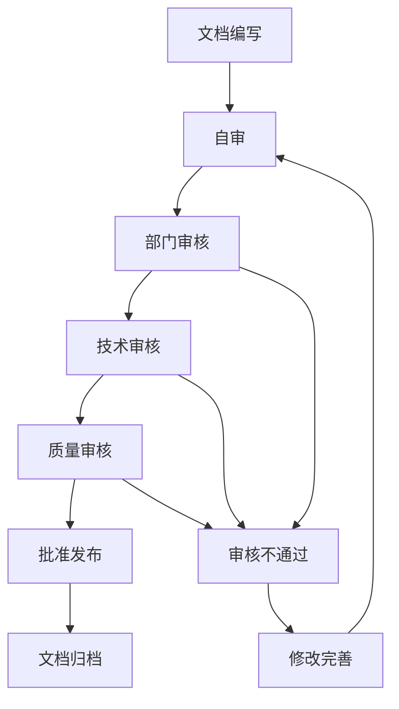
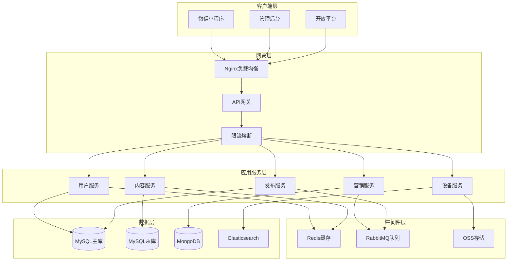
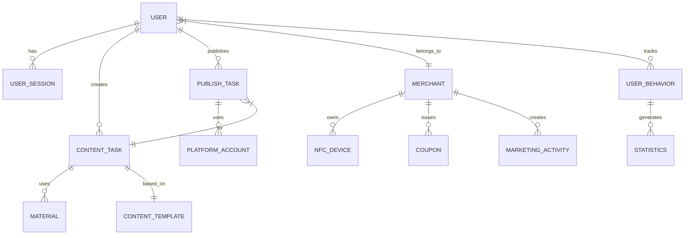
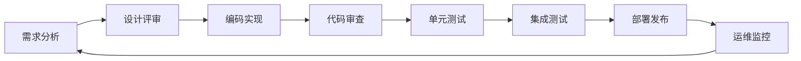
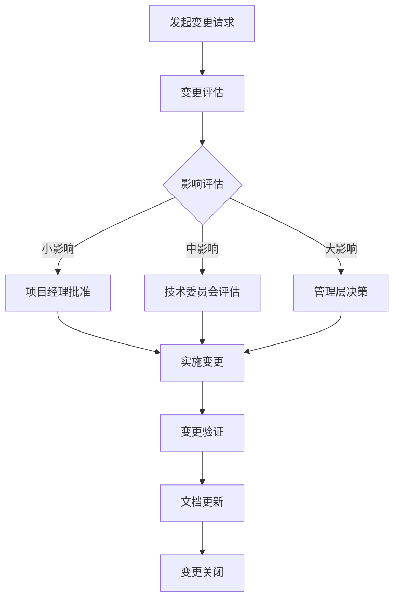

# 小磨推智能营销系统 - 项目文档体系与管理规范

---

## 文档封面信息

**文档名称**: 小磨推智能营销系统项目文档体系与管理规范
**文档编号**: XMT-DOC-2024-001
**版本号**: V1.0
**编写日期**: 2024年12月
**编写单位**: 小磨推科技有限公司
**密级**: 内部公开

---

## 版权声明

© 2024 小磨推科技有限公司 版权所有。本文档包含的技术信息和商业机密，未经本公司书面许可，任何单位或个人不得以任何形式复制、传播或使用。

---

## 第1章 项目文档体系概述 (共5页)

### 1.1 文档体系架构

#### 1.1.1 文档分类体系

小磨推智能营销系统采用分层、分类的文档管理体系，确保项目全生命周期的文档完整性和可追溯性。

```
项目文档体系
├── 01. 项目管理文档
│   ├── 1.1 项目立项文档
│   ├── 1.2 项目计划文档
│   ├── 1.3 项目报告文档
│   └── 1.4 项目总结文档
├── 02. 需求工程文档
│   ├── 2.1 市场分析文档
│   ├── 2.2 需求规格文档
│   ├── 2.3 需求变更文档
│   └── 2.4 需求跟踪文档
├── 03. 系统设计文档
│   ├── 3.1 概要设计文档
│   ├── 3.2 详细设计文档
│   ├── 3.3 接口设计文档
│   └── 3.4 数据库设计文档
├── 04. 开发实施文档
│   ├── 4.1 开发规范文档
│   ├── 4.2 编码规范文档
│   ├── 4.3 版本管理文档
│   └── 4.4 构建部署文档
├── 05. 测试验证文档
│   ├── 5.1 测试计划文档
│   ├── 5.2 测试用例文档
│   ├── 5.3 测试报告文档
│   └── 5.4 验收测试文档
└── 06. 运维管理文档
    ├── 6.1 部署手册文档
    ├── 6.2 运维手册文档
    ├── 6.3 故障处理文档
    └── 6.4 性能优化文档
```

#### 1.1.2 文档分级管理

1. **一级文档（核心文档）**
   - 项目立项报告
   - 需求规格说明书
   - 系统设计说明书
   - 测试计划与报告
   - 用户手册

2. **二级文档（重要文档）**
   - 项目计划书
   - 详细设计文档
   - 数据库设计文档
   - 接口文档
   - 部署手册

3. **三级文档（辅助文档）**
   - 会议纪要
   - 周报月报
   - 技术方案
   - 问题记录
   - 经验总结

### 1.2 文档管理规范

#### 1.2.1 文档命名规范

```
文档命名格式：XMT-[文档类型]-[日期]-[版本号]-[文档名称]

示例：
- XMT-REQ-20241201-V1.0-用户登录需求规格.docx
- XMT-DES-20241202-V2.1-支付模块详细设计.md
- XMT-TEST-20241210-V1.5-性能测试报告.pdf
```

#### 1.2.2 文档版本控制

| 版本阶段 | 版本号格式 | 说明 |
|---------|-----------|------|
| 草稿版本 | 0.x | 内部讨论，未经审核 |
| 评审版本 | 1.x-RCx | 评审中，待定稿 |
| 正式版本 | x.0 | 正式发布，已审核 |
| 修订版本 | x.y | 正式版本的修订 |

#### 1.2.3 文档审核流程



### 1.3 文档存储与访问

#### 1.3.1 文档存储结构

```
/xiaomotui-docs/
├── 01-项目管理/
│   ├── 立项阶段/
│   ├── 规划阶段/
│   ├── 执行阶段/
│   └── 收尾阶段/
├── 02-需求工程/
│   ├── 业务需求/
│   ├── 用户需求/
│   └── 功能需求/
├── 03-系统设计/
│   ├── 架构设计/
│   ├── 模块设计/
│   └── 界面设计/
├── 04-开发实施/
│   ├── 前端开发/
│   ├── 后端开发/
│   └── 数据库开发/
├── 05-测试验证/
│   ├── 单元测试/
│   ├── 集成测试/
│   └── 系统测试/
└── 06-运维支持/
    ├── 部署文档/
    ├── 监控文档/
    └── 故障处理/
```

#### 1.3.2 访问权限管理

| 角色 | 访问权限 | 说明 |
|------|---------|------|
| 项目经理 | 全部权限 | 读写、审核、批准 |
| 技术负责人 | 全部权限 | 读写、审核 |
| 开发人员 | 读写权限 | 访问指定文档 |
| 测试人员 | 读写权限 | 访问测试文档 |
| 客户代表 | 只读权限 | 访问需求文档 |

### 1.4 文档生命周期管理

#### 1.4.1 文档状态定义

- **创建中**: 新文档正在编写
- **审核中**: 提交审核待批
- **已发布**: 正式发布生效
- **修订中**: 进行版本更新
- **已归档**: 历史版本存档
- **已废弃**: 不再使用

#### 1.4.2 文档保留期限

| 文档类型 | 保留期限 | 备注 |
|---------|---------|------|
| 项目立项文档 | 永久 | 法律凭证 |
| 需求文档 | 5年 | 审计需要 |
| 设计文档 | 3年 | 维护参考 |
| 测试文档 | 2年 | 质量追溯 |
| 代码文档 | 永久 | 版本管理 |
| 会议纪要 | 1年 | 决策追溯 |

### 1.5 文档质量标准

#### 1.5.1 文档质量要求

1. **完整性**: 内容覆盖全面，无遗漏
2. **准确性**: 信息准确无误，无歧义
3. **一致性**: 格式统一，术语一致
4. **可读性**: 条理清晰，易于理解
5. **可维护性**: 便于更新和版本控制

#### 1.5.2 文档评分标准

| 评分项 | 权重 | 评分标准 |
|--------|------|----------|
| 内容完整性 | 30% | 90-100分:完整 80-89分:较完整 70-79分:基本完整 |
| 技术准确性 | 25% | 90-100分:准确 80-89分:较准确 70-79分:基本准确 |
| 逻辑清晰度 | 20% | 90-100分:清晰 80-89分:较清晰 70-79分:基本清晰 |
| 格式规范性 | 15% | 90-100分:规范 80-89分:较规范 70-79分:基本规范 |
| 语言表达 | 10% | 90-100分:优秀 80-89分:良好 70-79分:一般 |

---

## 第2章 需求分析和规格文档 (共7页)

### 2.1 需求分析概述

#### 2.1.1 项目背景

随着数字化营销的快速发展，商户对智能化营销工具的需求日益增长。小磨推智能营销系统旨在为中小商户提供一站式智能营销解决方案，通过AI技术降低营销门槛，提升营销效果。

#### 2.1.2 项目目标

1. **业务目标**
   - 服务10000+中小商户
   - 月均处理营销任务100万+
   - 用户满意度达到95%以上
   - 系统可用性99.9%

2. **技术目标**
   - 响应时间<200ms (P95)
   - 支持10000并发用户
   - 代码覆盖率达到80%
   - 安全漏洞0高危

3. **商业目标**
   - 第一年实现营收1000万
   - 市场占有率进入行业前五
   - 用户留存率达到70%
   - 客户投诉率<1%

### 2.2 业务需求分析

#### 2.2.1 用户画像

**主要用户群体**:

1. **小微商户主**
   - 年龄：25-45岁
   - 行业：餐饮、零售、服务
   - 技术水平：初级-中级
   - 痛点：缺乏营销经验、时间有限、预算紧张

2. **营销专员**
   - 年龄：22-35岁
   - 行业：各行业营销部门
   - 技术水平：中级-高级
   - 痛点：效率低下、创意枯竭、数据分散

3. **代理商/服务商**
   - 年龄：28-40岁
   - 业务：为商户提供营销服务
   - 技术水平：中级
   - 痛点：管理复杂、效果难量化

#### 2.2.2 业务场景

1. **场景一：新品推广**
   ```
   商户：奶茶店新品上市
   需求：快速生成推广文案和海报
   流程：选择模板→AI生成→多平台发布→数据追踪
   ```

2. **场景二：节日营销**
   ```
   商户：餐厅节假日促销
   需求：策划节日营销活动
   流程：活动策划→优惠券生成→NFC触发→转化分析
   ```

3. **场景三：客户维护**
   ```
   商户：美容院会员管理
   需求：精准推送和个性化服务
   流程：客户分群→内容定制→定时推送→效果评估
   ```

### 2.3 功能需求规格

#### 2.3.1 功能需求清单

**一级模块：用户认证与管理**

| 需求编号 | 需求名称 | 需求描述 | 优先级 |
|---------|---------|---------|-------|
| FR-001 | 微信授权登录 | 支持微信小程序一键登录 | 高 |
| FR-002 | 手机号登录 | 支持手机验证码登录 | 高 |
| FR-003 | 账号管理 | 用户信息修改、密码重置 | 中 |
| FR-004 | 权限管理 | 基于角色的权限控制 | 高 |
| FR-005 | 商户认证 | 商户资质审核与认证 | 高 |

**一级模块：智能内容创作**

| 需求编号 | 需求名称 | 需求描述 | 优先级 |
|---------|---------|---------|-------|
| FR-101 | 文案生成 | AI辅助营销文案生成 | 高 |
| FR-102 | 图片处理 | 智能海报生成与编辑 | 高 |
| FR-103 | 视频创作 | 短视频脚本与素材生成 | 中 |
| FR-104 | 内容审核 | 敏感词检测与合规审核 | 高 |
| FR-105 | 模板管理 | 内容模板创建与复用 | 中 |

**一级模块：多平台发布**

| 需求编号 | 需求名称 | 需求描述 | 优先级 |
|---------|---------|---------|-------|
| FR-201 | 微信生态 | 公众号、小程序、视频号发布 | 高 |
| FR-202 | 抖音平台 | 短视频自动发布 | 高 |
| FR-203 | 定时发布 | 预设时间自动发布 | 中 |
| FR-204 | 批量操作 | 多账号批量发布 | 中 |
| FR-205 | 发布状态 | 实时同步发布状态 | 高 |

**一级模块：营销活动管理**

| 需求编号 | 需求名称 | 需求描述 | 优先级 |
|---------|---------|---------|-------|
| FR-301 | 优惠券 | 优惠券创建、发放、核销 | 高 |
| FR-302 | 拼团活动 | 拼团活动设置与管理 | 中 |
| FR-303 | 秒杀活动 | 限时秒杀活动配置 | 中 |
| FR-304 | 会员积分 | 积分体系与兑换 | 低 |
| FR-305 | 推荐系统 | 智能商品推荐引擎 | 中 |

#### 2.3.2 功能需求详述

**FR-001 微信授权登录**

```gherkin
功能：微信授权登录
角色：商户用户
前置条件：安装微信小程序

场景：正常登录流程
Given 用户打开微信小程序
When 用户点击"微信授权登录"
Then 系统获取微信授权
And 系统自动创建/更新用户账号
And 系统返回登录成功信息
And 用户进入小程序首页

场景：用户拒绝授权
Given 用户打开微信小程序
When 用户点击"微信授权登录"
And 用户拒绝微信授权
Then 系统提示"需要授权才能使用"
And 系统提供手机号登录选项

场景：首次登录
Given 用户首次使用小程序
When 用户完成微信授权
Then 系统创建新用户账号
And 系统发送新用户欢迎消息
And 系统引导用户完善资料
```

**FR-101 文案生成**

```gherkin
功能：AI辅助营销文案生成
角色：商户用户
前置条件：用户已登录

场景：基础文案生成
Given 用户进入文案生成页面
When 用户输入产品信息"奶茶店新品-芝士奶盖茶"
And 用户选择风格"清新文艺"
And 用户选择长度"短文案"
And 用户点击"生成文案"
Then 系统调用AI服务生成文案
And 系统返回3条推荐文案
And 用户可以选择、编辑或重新生成

场景：带模板生成
Given 用户选择文案模板"新品上市"
When 用户填写产品名称"芝士奶盖茶"
And 用户填写特色"纯手工制作"
And 用户点击"生成"
Then 系统基于模板生成文案
And 生成文案包含模板结构
And 文案突出产品特色

场景：批量生成
Given 用户需要为多个产品生成文案
When 用户上传产品列表Excel
And 用户选择文案风格
And 用户点击"批量生成"
Then 系统为每个产品生成文案
And 系统展示批量生成进度
And 系统提供下载功能
```

### 2.4 非功能需求规格

#### 2.4.1 性能需求

| 指标项 | 要求值 | 测试条件 |
|--------|--------|---------|
| 响应时间 | ≤ 200ms (P95) | 正常负载下API请求 |
| 吞吐量 | ≥ 1000 TPS | 登录、内容生成接口 |
| 并发用户 | ≥ 5000 | 峰值时段同时在线 |
| 数据处理 | ≥ 10000条/分钟 | 营销数据分析 |
| 文件上传 | ≤ 5秒 | 10MB以内图片/视频 |

#### 2.4.2 可用性需求

- **系统可用性**: ≥ 99.9% (每月宕机时间≤ 43.2分钟)
- **故障恢复**: RTO ≤ 30分钟，RPO ≤ 5分钟
- **数据备份**: 每日全量备份，实时增量备份
- **灾难恢复**: 支持两地三中心部署

#### 2.4.3 安全性需求

1. **身份认证**
   - 支持JWT令牌认证
   - 令牌有效期2小时
   - 支持令牌刷新机制

2. **数据安全**
   - 传输加密：TLS 1.3
   - 存储加密：AES-256
   - 敏感数据脱敏

3. **访问控制**
   - 基于RBAC权限模型
   - API接口鉴权
   - 操作日志记录

4. **合规要求**
   - 符合《网络安全法》
   - 符合《个人信息保护法》
   - 通过等级保护三级认证

#### 2.4.4 扩展性需求

- **水平扩展**: 支持通过增加服务器节点扩展处理能力
- **存储扩展**: 支持分布式存储，容量可弹性扩展
- **功能扩展**: 模块化设计，支持功能模块插拔
- **平台扩展**: 支持新增营销平台对接

### 2.5 需求跟踪矩阵

#### 2.5.1 需求到设计的跟踪

| 需求编号 | 需求描述 | 设计模块 | 责任人 | 状态 |
|---------|---------|---------|-------|------|
| FR-001 | 微信授权登录 | 用户认证模块 | 张三 | 已完成 |
| FR-101 | 文案生成 | AI内容服务 | 李四 | 开发中 |
| FR-201 | 微信发布 | 平台对接模块 | 王五 | 待开始 |
| FR-301 | 优惠券 | 营销活动模块 | 赵六 | 已完成 |

#### 2.5.2 需求变更管理

1. **变更申请流程**
   ```
   变更申请人填写变更单 → 部门经理审批 → 技术评估 →
   影响分析 → 变更委员会审批 → 实施变更 → 验证确认
   ```

2. **变更影响评估矩阵**

| 影响维度 | 评估项 | 权重 | 评分(1-5) |
|---------|--------|------|----------|
| 技术复杂度 | 实现难度 | 30% | 3 |
| 进度影响 | 延期风险 | 25% | 2 |
| 成本影响 | 预算增加 | 20% | 2 |
| 质量影响 | 系统稳定性 | 15% | 3 |
| 业务价值 | 商业收益 | 10% | 5 |

3. **变更审批权限**
   - 小型变更：影响<3人天 → 项目经理审批
   - 中型变更：影响3-10人天 → 技术总监审批
   - 大型变更：影响>10人天 → 变更委员会审批

### 2.6 需求验证标准

#### 2.6.1 验收标准制定

**功能验收标准**:
- 所有高优先级需求100%实现
- 中优先级需求90%实现
- 低优先级需求80%实现
- 功能测试用例通过率≥95%

**性能验收标准**:
- 压力测试达到并发用户数要求
- 响应时间满足性能指标
- 系统稳定运行72小时无故障
- 内存使用率<80%

**安全验收标准**:
- 通过安全扫描，无高危漏洞
- 渗透测试通过率100%
- 数据加密验证通过
- 权限控制测试通过

#### 2.6.2 用户验收测试（UAT）

1. **测试场景覆盖**
   - 核心业务流程全覆盖
   - 异常场景覆盖80%
   - 边界条件验证
   - 用户界面友好性验证

2. **验收测试执行**
   - 准备测试环境和测试数据
   - 执行测试用例
   - 记录测试结果
   - 编写验收测试报告

3. **验收签字确认**
   ```
   用户方测试负责人签字：__________ 日期：__________
   开发方技术负责人签字：__________ 日期：__________
   项目经理签字：__________________ 日期：__________
   ```

---

## 第3章 系统设计文档 (共8页)

### 3.1 系统架构设计

#### 3.1.1 总体架构

小磨推智能营销系统采用微服务架构设计，基于领域驱动设计(DDD)理念，实现高内聚、低耦合的系统结构。

**架构原则**：
1. 分层解耦：清晰的分层架构，每层职责明确
2. 服务化：业务功能服务化，独立部署和扩展
3. 弹性设计：支持水平扩展和故障自愈
4. 安全优先：安全设计贯穿架构各个层次
5. 云原生：支持容器化部署和云平台托管

#### 3.1.2 架构分层设计

```
┌─────────────────────────────────────────────────────────────┐
│                        接入层 (API Gateway)                  │
│  - Nginx/Envoy  - 路由转发  - 负载均衡  - 限流熔断            │
└─────────────────────────────────────────────────────────────┘
                                │
┌─────────────────────────────────────────────────────────────┐
│                        业务服务层 (Microservices)           │
├─────────────────┬─────────────────┬─────────────────────────┤
│  用户服务        │  内容服务        │  营销服务              │
│  - 认证授权      │  - AI生成        │  - 活动管理            │
│  - 用户管理      │  - 内容审核      │  - 优惠券              │
│  - 权限控制      │  - 素材管理      │  - 推荐系统            │
├─────────────────┼─────────────────┼─────────────────────────┤
│  设备服务        │  发布服务        │  分析服务              │
│  - NFC管理       │  - 平台对接      │  - 数据统计            │
│  - WiFi探针      │  - 定时任务      │  - 报表生成            │
│  - 触发规则      │  - 批量操作      │  - 实时监控            │
└─────────────────┴─────────────────┴─────────────────────────┘
                                │
┌─────────────────────────────────────────────────────────────┐
│                        基础设施层 (Infrastructure)           │
├─────────────┬─────────────┬─────────────┬───────────────────┤
│   数据存储   │   消息队列   │   缓存服务   │    搜索引擎        │
│   - MySQL    │   - RabbitMQ │   - Redis    │    - Elasticsearch│
│   - MongoDB  │   - RocketMQ │   - Memcached│                   │
├─────────────┼─────────────┼─────────────┼───────────────────┤
│   文件存储   │   监控告警   │   日志系统   │    配置中心        │
│   - OSS      │   - Prometheus│   - ELK     │    - Nacos         │
│   - CDN      │   - Grafana   │   - Flume    │    - Apollo       │
└─────────────┴─────────────┴─────────────┴───────────────────┘
```

#### 3.1.3 微服务拆分方案

| 服务名称 | 服务边界 | 技术栈 | 数据存储 |
|---------|---------|--------|----------|
| user-service | 用户管理、认证授权 | Spring Boot | MySQL |
| content-service | 内容生成、审核管理 | ThinkPHP | MySQL + MongoDB |
| marketing-service | 营销活动、优惠券 | Node.js | Redis + MySQL |
| device-service | 设备管理、触发规则 | Go | MySQL |
| publish-service | 内容发布、平台对接 | Python | MySQL |
| analytics-service | 数据分析、报表 | Java | ClickHouse |
| notification-service | 消息推送、通知 | Node.js | Redis |

### 3.2 技术架构设计

#### 3.2.1 技术选型说明

**后端技术栈**：

| 技术领域 | 选型方案 | 版本 | 选型理由 |
|---------|---------|------|---------|
| 开发框架 | ThinkPHP 8.0 | 8.0 | 成熟稳定、开发效率高、中文文档完善 |
| 编程语言 | PHP | 8.1 | 性能提升、JIT编译、新特性支持 |
| 数据库 | MySQL | 8.0 | ACID事务、索引优化、JSON支持 |
| 缓存 | Redis | 6.2 | 高性能、数据结构丰富、持久化 |
| 搜索 | Elasticsearch | 7.17 | 全文搜索、实时分析、可视化 |
| 消息队列 | RabbitMQ | 3.9 | 可靠性高、路由灵活、管理界面完善 |
| 容器化 | Docker | 20.10 | 环境一致性、快速部署、资源隔离 |
| 编排工具 | Kubernetes | 1.24 | 自动扩缩容、服务发现、故障自愈 |

**前端技术栈**：

| 技术领域 | 选型方案 | 版本 | 选型理由 |
|---------|---------|------|---------|
| 小程序框架 | 原生微信小程序 | - | 原生体验、性能最优 |
| 管理后台 | Vue 3 + TypeScript | 3.3 | 组合式API、TypeScript支持 |
| UI组件库 | Element Plus | 2.3 | 组件丰富、设计规范 |
| 构建工具 | Vite | 4.0 | 快速热更新、ES模块 |
| 状态管理 | Pinia | 2.1 | Vue3官方推荐、类型安全 |

#### 3.2.2 技术架构图



### 3.3 数据架构设计

#### 3.3.1 数据存储策略

**数据分层存储架构**：

```
┌─────────────────────────────────────────────────────────────┐
│                        应用数据层                            │
│  - 用户数据  - 商户数据  - 内容数据  - 订单数据              │
│  存储方式：MySQL主从架构，读写分离                          │
└─────────────────────────────────────────────────────────────┘
                                │
┌─────────────────────────────────────────────────────────────┐
│                        缓存数据层                            │
│  - Session数据  - 热点数据  - 临时数据  - 计数器             │
│  存储方式：Redis集群，数据分片                              │
└─────────────────────────────────────────────────────────────┘
                                │
┌─────────────────────────────────────────────────────────────┐
│                        文档数据层                            │
│  - 日志数据  - 配置数据  - 模板数据  - 素材数据              │
│  存储方式：MongoDB副本集                                    │
└─────────────────────────────────────────────────────────────┘
                                │
┌─────────────────────────────────────────────────────────────┐
│                        文件存储层                            │
│  - 图片文件  - 视频文件  - 文档文件  - 备份文件              │
│  存储方式：对象存储OSS + CDN分发                           │
└─────────────────────────────────────────────────────────────┘
```

#### 3.3.2 数据库设计

**核心ER图**：



**数据分库分表策略**：

| 表名 | 分片策略 | 分片字段 | 分片数量 |
|------|---------|---------|----------|
| user_behavior | 按时间 | created_at | 按月分片 |
| statistics | 按商户 | merchant_id | 16个分片 |
| publish_task | 按ID | id | 哈希分片 |
| content_feedback | 按时间 | created_at | 按季度分片 |

#### 3.3.3 数据治理规范

1. **数据标准规范**
   - 主键规范：统一使用bigint自增ID
   - 时间字段：统一使用datetime类型
   - 状态字段：使用tinyint，0表示无效，1表示有效
   - 软删除：delete_time字段，NULL表示未删除

2. **数据质量管控**
   - 数据完整性检查：非空约束、唯一约束
   - 数据一致性检查：外键约束、事务保证
   - 数据准确性检查：数据校验规则
   - 数据及时性检查：时间戳管理

### 3.4 接口设计

#### 3.4.1 API设计规范

**RESTful API规范**：

```
URL设计规范：
- 使用名词复数形式：/api/v1/users
- 使用小写字母和连字符：/api/v1/user-behaviors
- 资源嵌套：/api/v1/merchants/{id}/coupons

HTTP方法使用：
- GET：查询资源列表或单个资源
- POST：创建新资源
- PUT：完整更新资源
- PATCH：部分更新资源
- DELETE：删除资源

状态码规范：
- 200：成功
- 201：创建成功
- 204：删除成功
- 400：请求参数错误
- 401：未授权
- 403：禁止访问
- 404：资源不存在
- 422：数据验证失败
- 500：服务器内部错误
```

**响应格式规范**：

```json
{
  "code": 200,
  "msg": "success",
  "timestamp": 1703980800,
  "request_id": "uuid-string",
  "data": {
    // 响应数据
  },
  "pagination": {  // 分页信息（列表接口）
    "current_page": 1,
    "per_page": 20,
    "total": 100,
    "last_page": 5
  },
  "errors": {  // 错误信息（失败时）
    "field": "error message"
  }
}
```

#### 3.4.2 接口安全设计

1. **认证机制**
   - 使用JWT Bearer Token认证
   - Token有效期：访问令牌2小时，刷新令牌7天
   - Token黑名单机制，支持主动撤销

2. **鉴权机制**
   - RBAC权限模型
   - 接口级权限控制
   - 数据级权限隔离

3. **安全防护**
   - API签名验证（关键接口）
   - 请求限流：用户维度和IP维度
   - SQL注入和XSS攻击防护
   - 敏感数据加密传输

#### 3.4.3 接口文档管理

使用Swagger/OpenAPI 3.0规范管理接口文档：

```yaml
openapi: 3.0.0
info:
  title: 小磨推智能营销系统API
  version: 1.0.0
  description: 提供智能营销相关功能的RESTful API

servers:
  - url: https://api.xiaomotui.com/v1
    description: 生产环境
  - url: https://dev-api.xiaomotui.com/v1
    description: 测试环境

security:
  - BearerAuth: []

paths:
  /auth/login:
    post:
      summary: 用户登录
      tags:
        - 认证模块
      requestBody:
        required: true
        content:
          application/json:
            schema:
              $ref: '#/components/schemas/LoginRequest'
      responses:
        '200':
          description: 登录成功
          content:
            application/json:
              schema:
                $ref: '#/components/schemas/LoginResponse'
```

### 3.5 安全架构设计

#### 3.5.1 安全体系架构

```
┌─────────────────────────────────────────────────────────────┐
│                        网络安全层                            │
│  - HTTPS/TLS加密  - DDoS防护  - WAF防火墙  - VPN接入          │
└─────────────────────────────────────────────────────────────┘
                                │
┌─────────────────────────────────────────────────────────────┐
│                        应用安全层                            │
│  - 身份认证  - 权限控制  - 会话管理  - API鉴权               │
└─────────────────────────────────────────────────────────────┘
                                │
┌─────────────────────────────────────────────────────────────┐
│                        数据安全层                            │
│  - 传输加密  - 存储加密  - 数据脱敏  - 备份加密               │
└─────────────────────────────────────────────────────────────┘
                                │
┌─────────────────────────────────────────────────────────────┐
│                        运维安全层                            │
│  - 安全审计  - 漏洞扫描  - 入侵检测  - 应急响应               │
└─────────────────────────────────────────────────────────────┘
```

#### 3.5.2 数据安全设计

1. **传输安全**
   - 全站HTTPS，TLS 1.3协议
   - API接口使用SSL证书
   - 敏感接口添加签名验证

2. **存储安全**
   - 数据库连接加密
   - 敏感字段AES-256加密存储
   - 密码使用Argon2ID哈希

3. **数据脱敏规则**

| 数据类型 | 脱敏规则 | 示例 |
|---------|---------|------|
| 手机号 | 保留前3后4 | 138****8000 |
| 身份证 | 保留前3后4 | 110***********1234 |
| 银行卡 | 保留前6后4 | 622202***********1234 |
| 邮箱 | 保留前3后@域 | 138****@example.com |

### 3.6 部署架构设计

#### 3.6.1 云原生部署架构

```yaml
# Kubernetes部署配置
apiVersion: apps/v1
kind: Deployment
metadata:
  name: xiaomotui-api
spec:
  replicas: 3
  selector:
    matchLabels:
      app: xiaomotui-api
  template:
    metadata:
      labels:
        app: xiaomotui-api
    spec:
      containers:
      - name: api
        image: xiaomotui/api:v1.0.0
        ports:
        - containerPort: 80
        env:
        - name: DB_HOST
          valueFrom:
            secretKeyRef:
              name: db-secret
              key: host
        resources:
          requests:
            memory: "512Mi"
            cpu: "250m"
          limits:
            memory: "1Gi"
            cpu: "500m"
        livenessProbe:
          httpGet:
            path: /health
            port: 80
          initialDelaySeconds: 30
          periodSeconds: 10
        readinessProbe:
          httpGet:
            path: /ready
            port: 80
          initialDelaySeconds: 5
          periodSeconds: 5
```

#### 3.6.2 高可用架构

1. **负载均衡**
   - Nginx反向代理
   - 健康检查机制
   - 故障节点自动剔除

2. **数据库高可用**
   - MySQL主从复制
   - MHA高可用方案
   - 读写分离

3. **缓存高可用**
   - Redis Sentinel
   - 数据持久化
   - 故障自动切换

4. **服务高可用**
   - 服务多实例部署
   - Kubernetes自动扩缩容
   - 服务熔断降级

### 3.7 监控架构设计

#### 3.7.1 监控体系

```
┌─────────────────────────────────────────────────────────────┐
│                        基础设施监控                          │
│  - CPU使用率  - 内存使用率  - 磁盘IO  - 网络流量              │
└─────────────────────────────────────────────────────────────┘
                                │
┌─────────────────────────────────────────────────────────────┐
│                        应用性能监控                          │
│  - 响应时间  - 吞吐量  - 错误率  - 业务指标                  │
└─────────────────────────────────────────────────────────────┘
                                │
┌─────────────────────────────────────────────────────────────┐
│                        日志监控                              │
│  - 业务日志  - 错误日志  - 访问日志  - 审计日志              │
└─────────────────────────────────────────────────────────────┘
                                │
┌─────────────────────────────────────────────────────────────┐
│                        告警管理                              │
│  - 告警规则  - 告警聚合  - 告警通知  - 告警升级              │
└─────────────────────────────────────────────────────────────┘
```

#### 3.7.2 监控指标体系

1. **系统指标**
   - CPU使用率：告警阈值80%
   - 内存使用率：告警阈值85%
   - 磁盘使用率：告警阈值90%
   - 网络带宽：告警阈值80%

2. **应用指标**
   - API响应时间：P95 < 200ms
   - 错误率：< 1%
   - QPS：峰值监控
   - 活跃用户数：实时统计

3. **业务指标**
   - 内容生成成功率：> 95%
   - 发布成功率：> 99%
   - 用户留存率：日留存> 60%
   - 转化率：> 5%

---

## 第4章 开发规范和标准 (共6页)

### 4.1 开发流程规范

#### 4.1.1 开发生命周期



#### 4.1.2 Git工作流程

采用GitFlow分支管理模型：

```
main分支       ----生产环境，稳定版本
  ↑
release分支   ----发布准备，bug修复
  ↑
develop分支   ----开发主分支，功能集成
  ↑
feature分支   ----功能开发
  ↑
hotfix分支    ----紧急修复
```

**分支命名规范**：
- feature: feature/功能名称
- hotfix: hotfix/问题描述
- release: release/版本号
- tag: v主版本.次版本.修订号

#### 4.1.3 代码提交规范

使用Conventional Commits规范：

```
<type>[optional scope]: <description>

[optional body]

[optional footer(s)]
```

**提交类型**：
- feat: 新功能
- fix: 修复bug
- docs: 文档更新
- style: 代码格式化
- refactor: 代码重构
- test: 测试相关
- chore: 构建或工具相关

**示例**：
```
feat(auth): add WeChat mini-program login

- Implement WeChat OAuth2.0 flow
- Add user session management
- Update login documentation

Closes #123
```

### 4.2 编码规范

#### 4.2.1 PHP编码规范

遵循PSR-1、PSR-2、PSR-12标准：

**1. 类和接口命名**
```php
<?php
namespace App\Service;

class ContentService implements ContentServiceInterface
{
    private const MAX_RETRY_COUNT = 3;

    private string $apiKey;

    public function __construct(string $apiKey)
    {
        $this->apiKey = $apiKey;
    }

    public function generateContent(array $params): array
    {
        // Implementation
    }
}
```

**2. 方法定义**
```php
/**
 * Generate marketing content
 *
 * @param array $params Generation parameters
 * @return array Generated content with metadata
 * @throws InvalidArgumentException When parameters are invalid
 * @throws RuntimeException When generation fails
 */
public function generateContent(array $params): array
{
    $this->validateParams($params);

    try {
        $content = $this->callAIService($params);
        return $this->formatResult($content);
    } catch (\Exception $e) {
        throw new RuntimeException('Content generation failed: ' . $e->getMessage());
    }
}
```

**3. 错误处理**
```php
try {
    $result = $this->processData($data);
} catch (ValidationException $e) {
    Log::warning('Data validation failed', [
        'data' => $data,
        'error' => $e->getMessage()
    ]);
    throw $e;
} catch (\Exception $e) {
    Log::error('Unexpected error during data processing', [
        'data' => $data,
        'error' => $e->getMessage(),
        'trace' => $e->getTraceAsString()
    ]);
    throw new RuntimeException('Processing failed');
}
```

#### 4.2.2 数据库设计规范

**1. 表设计规范**
```sql
CREATE TABLE `xmt_content_tasks` (
  `id` bigint(20) unsigned NOT NULL AUTO_INCREMENT COMMENT '任务ID',
  `user_id` bigint(20) unsigned NOT NULL COMMENT '用户ID',
  `merchant_id` bigint(20) unsigned NOT NULL COMMENT '商户ID',
  `task_type` varchar(20) NOT NULL DEFAULT 'text' COMMENT '任务类型',
  `title` varchar(200) NOT NULL DEFAULT '' COMMENT '标题',
  `content` longtext COMMENT '内容',
  `status` tinyint(1) NOT NULL DEFAULT 0 COMMENT '状态',
  `created_at` datetime NOT NULL DEFAULT CURRENT_TIMESTAMP COMMENT '创建时间',
  `updated_at` datetime NOT NULL DEFAULT CURRENT_TIMESTAMP ON UPDATE CURRENT_TIMESTAMP COMMENT '更新时间',
  `deleted_at` datetime DEFAULT NULL COMMENT '删除时间',
  PRIMARY KEY (`id`),
  KEY `idx_user_id` (`user_id`),
  KEY `idx_merchant_id` (`merchant_id`),
  KEY `idx_status` (`status`),
  KEY `idx_created_at` (`created_at`)
) ENGINE=InnoDB DEFAULT CHARSET=utf8mb4 COLLATE=utf8mb4_unicode_ci COMMENT='内容任务表';
```

**2. 索引设计原则**
- 主键使用自增ID
- 外键建立索引
- 经常查询的字段建立索引
- 避免在大字段上建立索引

**3. 查询优化**
```php
// 优化前
$tasks = Db::table('content_tasks')
    ->where('user_id', $userId)
    ->where('status', '!=', -1)
    ->orderBy('created_at', 'desc')
    ->get();

// 优化后：使用索引，限制查询字段
$tasks = Db::table('content_tasks')
    ->where('user_id', $userId)
    ->where('status', '>=', 0)
    ->select(['id', 'title', 'status', 'created_at'])
    ->orderBy('id', 'desc')
    ->limit(20)
    ->get();
```

#### 4.2.3 API接口规范

**1. 控制器定义**
```php
<?php
namespace App\Controller;

use App\Service\ContentService;
use App\Request\ContentGenerateRequest;
use App\Response\ApiResponse;

class ContentController extends BaseController
{
    private ContentService $contentService;

    public function __construct(ContentService $contentService)
    {
        $this->contentService = $contentService;
    }

    /**
     * @OA\Post(
     *     path="/content/generate",
     *     tags={"Content"},
     *     summary="Generate marketing content",
     *     @OA\RequestBody(
     *         @OA\JsonContent(ref="#/components/schemas/ContentGenerateRequest")
     *     ),
     *     @OA\Response(
     *         response=200,
     *         description="Success",
     *         @OA\JsonContent(ref="#/components/schemas/ContentGenerateResponse")
     *     )
     * )
     */
    public function generate(ContentGenerateRequest $request): ApiResponse
    {
        try {
            $result = $this->contentService->generate($request->validated());
            return ApiResponse::success($result);
        } catch (\Exception $e) {
            return ApiResponse::error($e->getMessage(), 500);
        }
    }
}
```

**2. 请求验证**
```php
<?php
namespace App\Request;

use Illuminate\Foundation\Http\FormRequest;

class ContentGenerateRequest extends FormRequest
{
    public function authorize(): bool
    {
        return true;
    }

    public function rules(): array
    {
        return [
            'type' => 'required|in:text,image,video',
            'prompt' => 'required|string|max:1000',
            'params.style' => 'sometimes|in:professional,casual,creative',
            'params.length' => 'sometimes|in:short,medium,long',
            'params.industry' => 'sometimes|string|max:50',
        ];
    }

    public function messages(): array
    {
        return [
            'type.required' => 'Content type is required',
            'type.in' => 'Invalid content type',
            'prompt.required' => 'Prompt is required',
            'prompt.max' => 'Prompt too long, max 1000 characters',
        ];
    }
}
```

### 4.3 代码质量管理

#### 4.3.1 代码审查清单

**功能性检查**：
- [ ] 代码实现了需求规格中的所有功能
- [ ] 边界条件已处理
- [ ] 异常情况有适当处理
- [ ] 单元测试覆盖率≥80%

**性能检查**：
- [ ] 无明显的性能瓶颈
- [ ] 数据库查询已优化
- [ ] 避免N+1查询问题
- [ ] 大数据量考虑分页处理

**安全检查**：
- [ ] 输入参数已验证
- [ ] SQL注入已防护
- [ ] XSS攻击已防护
- [ ] 敏感信息未硬编码

**可维护性检查**：
- [ ] 代码结构清晰
- [ ] 函数职责单一
- [ ] 命名规范一致
- [ ] 注释充分准确

#### 4.3.2 静态代码分析

使用PHPStan进行静态分析：

```php
// phpstan.neon
parameters:
    level: 6
    paths:
        - app
    checkMissingIterableValueType: false
    checkGenericClassInNonGenericObjectType: false
    ignoreErrors:
        - '#Call to an undefined method#'
    excludePaths:
        - app/Console/Commands
```

#### 4.3.3 持续集成配置

```yaml
# .github/workflows/ci.yml
name: CI

on: [push, pull_request]

jobs:
  test:
    runs-on: ubuntu-latest

    services:
      mysql:
        image: mysql:8.0
        env:
          MYSQL_ROOT_PASSWORD: root
          MYSQL_DATABASE: xiaomotui_test
        options: >-
          --health-cmd="mysqladmin ping"
          --health-interval=10s
          --health-timeout=5s
          --health-retries=3
        ports:
          - 3306:3306

      redis:
        image: redis:6.2
        options: >-
          --health-cmd="redis-cli ping"
          --health-interval=10s
          --health-timeout=5s
          --health-retries=3
        ports:
          - 6379:6379

    steps:
    - uses: actions/checkout@v3

    - name: Setup PHP
      uses: shivammathur/setup-php@v2
      with:
        php-version: '8.1'
        extensions: bcmath, gd, intl, pdo_mysql, redis
        coverage: xdebug

    - name: Copy environment file
      run: cp .env.testing .env

    - name: Install dependencies
      run: composer install --prefer-dist --no-progress

    - name: Generate key
      run: php artisan key:generate

    - name: Run migrations
      run: php artisan migrate

    - name: Run PHPStan
      run: vendor/bin/phpstan analyse

    - name: Run tests
      run: vendor/bin/phpunit --coverage-clover=coverage.xml

    - name: Upload coverage
      uses: codecov/codecov-action@v3
```

### 4.4 测试规范

#### 4.4.1 测试金字塔

```
┌─────────────────────────────────────────────────────────────┐
│                    E2E测试 (10%)                            │
│  - 关键业务流程验证                                        │
└─────────────────────────────────────────────────────────────┘
                                │
┌─────────────────────────────────────────────────────────────┐
│                    集成测试 (20%)                           │
│  - API接口测试  - 数据库集成测试  - 外部服务集成             │
└─────────────────────────────────────────────────────────────┘
                                │
┌─────────────────────────────────────────────────────────────┐
│                    单元测试 (70%)                           │
│  - 函数测试  - 类测试  - 模块测试                          │
└─────────────────────────────────────────────────────────────┘
```

#### 4.4.2 单元测试规范

```php
<?php
namespace Tests\Unit;

use App\Service\ContentService;
use Tests\TestCase;

class ContentServiceTest extends TestCase
{
    private ContentService $contentService;

    protected function setUp(): void
    {
        parent::setUp();
        $this->contentService = new ContentService();
    }

    public function testGenerateTextContent()
    {
        // Arrange
        $params = [
            'type' => 'text',
            'prompt' => '奶茶店新品促销',
            'params' => [
                'style' => 'professional',
                'length' => 'short'
            ]
        ];

        // Act
        $result = $this->contentService->generateContent($params);

        // Assert
        $this->assertIsArray($result);
        $this->assertArrayHasKey('content', $result);
        $this->assertArrayHasKey('usage', $result);
        $this->assertNotEmpty($result['content']);
    }

    /**
     * @dataProvider invalidParamsProvider
     */
    public function testGenerateContentWithInvalidParams($params, $expectedException)
    {
        $this->expectException($expectedException);

        $this->contentService->generateContent($params);
    }

    public function invalidParamsProvider(): array
    {
        return [
            'empty prompt' => [
                ['type' => 'text', 'prompt' => ''],
                \InvalidArgumentException::class
            ],
            'invalid type' => [
                ['type' => 'invalid', 'prompt' => 'test'],
                \InvalidArgumentException::class
            ],
        ];
    }
}
```

#### 4.4.3 集成测试规范

```php
<?php
namespace Tests\Feature;

use App\Models\User;
use Illuminate\Foundation\Testing\RefreshDatabase;
use Tests\TestCase;

class ContentGenerationTest extends TestCase
{
    use RefreshDatabase;

    public function testUserCanGenerateContent()
    {
        // Arrange
        $user = User::factory()->create();
        $token = auth('api')->login($user);

        $data = [
            'type' => 'text',
            'prompt' => '为咖啡店写促销文案',
            'params' => [
                'style' => 'casual',
                'industry' => '餐饮'
            ]
        ];

        // Act
        $response = $this->withHeaders([
            'Authorization' => 'Bearer ' . $token
        ])->postJson('/api/content/generate', $data);

        // Assert
        $response->assertStatus(200)
                 ->assertJsonStructure([
                     'code',
                     'msg',
                     'data' => [
                         'content_id',
                         'content',
                         'usage'
                     ]
                 ]);

        $this->assertDatabaseHas('content_tasks', [
            'user_id' => $user->id,
            'task_type' => 'text',
            'status' => 'completed'
        ]);
    }
}
```

### 4.5 性能优化规范

#### 4.5.1 代码性能优化

**1. 数据库查询优化**
```php
// 优化前：N+1查询
$users = User::all();
foreach ($users as $user) {
    echo $user->profile->bio;
}

// 优化后：预加载
$users = User::with('profile')->get();
foreach ($users as $user) {
    echo $user->profile->bio;
}
```

**2. 缓存使用规范**
```php
// 使用缓存装饰器模式
class ContentService
{
    private CacheInterface $cache;

    public function getPopularContent(int $limit = 10): array
    {
        $cacheKey = "popular_content:{$limit}";

        return $this->cache->remember($cacheKey, 3600, function() use ($limit) {
            return $this->repository->getPopularContent($limit);
        });
    }
}
```

#### 4.5.2 前端性能优化

**1. 代码分割**
```javascript
// 路由级代码分割
const routes = [
  {
    path: '/dashboard',
    component: () => import(/* webpackChunkName: "dashboard" */ './views/Dashboard.vue')
  },
  {
    path: '/analytics',
    component: () => import(/* webpackChunkName: "analytics" */ './views/Analytics.vue')
  }
];
```

**2. 图片懒加载**
```vue
<template>
  
</template>

<script>
import VueLazyload from 'vue-lazyload';

export default {
  directives: {
    lazy: VueLazyload.directive
  }
};
</script>
```

### 4.6 文档规范

#### 4.6.1 代码注释规范

**1. PHPDoc注释**
```php
/**
 * 类的简短描述
 *
 * 类的详细描述，可以包含多行
 *
 * @package App\Service
 * @author  开发者姓名 <email@example.com>
 * @version 1.0.0
 * @since   2024-01-01
 */
class ContentService
{
    /**
     * 生成营销内容
     *
     * 根据提供的参数生成营销内容，支持文本、图片、视频等多种类型
     *
     * @param array $params 生成参数，包含类型、提示词、风格等
     * @return array 返回生成的内容和元数据
     * @throws InvalidArgumentException 当参数无效时抛出
     * @throws RuntimeException 当生成失败时抛出
     * @example
     * $service = new ContentService();
     * $result = $service->generateContent([
     *     'type' => 'text',
     *     'prompt' => '奶茶店促销',
     *     'params' => ['style' => 'casual']
     * ]);
     */
    public function generateContent(array $params): array
    {
        // Implementation
    }
}
```

**2. 内联注释规范**
```php
// 计算用户等级折扣 - 注释在代码上方，说明代码块功能
$discount = $this->calculateDiscount($user->level, $orderAmount);

// TODO: 临时方案，需要重构 - 标记待办事项
// FIXME: 修复偶发的空指针异常 - 标记问题
// NOTE: 使用缓存提高性能 - 重要说明
$totalPrice += $discount; // 应用折扣 - 行尾注释，说明单行代码
```

#### 4.6.2 API文档规范

使用OpenAPI 3.0规范编写接口文档：

```yaml
paths:
  /api/v1/content:
    get:
      tags:
        - Content
      summary: Get content list
      description: Retrieve paginated list of content items
      operationId: getContentList
      parameters:
        - name: page
          in: query
          description: Page number
          required: false
          schema:
            type: integer
            minimum: 1
            default: 1
        - name: per_page
          in: query
          description: Items per page
          required: false
          schema:
            type: integer
            minimum: 1
            maximum: 100
            default: 20
      responses:
        '200':
          description: Successful response
          content:
            application/json:
              schema:
                $ref: '#/components/schemas/ContentListResponse'
        '401':
          $ref: '#/components/responses/Unauthorized'
```

---

## 第5章 测试文档体系 (共5页)

### 5.1 测试策略与计划

#### 5.1.1 测试策略

小磨推智能营销系统采用分层测试策略，确保产品质量和用户体验：

**1. 测试分层策略**

| 测试层级 | 测试目标 | 责任人 | 测试周期 |
|---------|---------|--------|----------|
| 单元测试 | 函数/方法正确性 | 开发人员 | 每次提交 |
| 集成测试 | 模块间协作 | 开发/测试人员 | 每日构建 |
| 系统测试 | 端到端功能 | 测试团队 | 每个迭代 |
| 验收测试 | 业务需求满足 | 产品/业务方 | 发布前 |
| 性能测试 | 性能指标达标 | 测试团队 | 版本发布 |
| 安全测试 | 安全漏洞排查 | 安全团队 | 版本发布 |

**2. 测试环境规划**

| 环境名称 | 用途 | 数据来源 | 更新频率 |
|---------|------|---------|----------|
| 开发环境 | 功能开发调试 | 测试数据 | 按需 |
| 测试环境 | 功能测试验证 | 脱敏生产数据 | 每日 |
| 预发环境 | 上线前验证 | 生产数据镜像 | 发布前 |
| 生产环境 | 正式运行 | 真实数据 | 实时 |

#### 5.1.2 测试计划模板

```
项目名称：小磨推智能营销系统V1.0
测试周期：2024.12.01 - 2024.12.31

1. 测试目标
   - 功能测试覆盖率 ≥ 95%
   - 自动化测试覆盖率 ≥ 80%
   - 性能指标满足设计要求
   - 安全漏洞高危等级为0

2. 测试范围
   2.1 包含范围
   - 用户认证模块
   - 内容生成模块
   - 营销活动模块
   - 数据分析模块

   2.2 不包含范围
   - 第三方平台内部功能
   - 硬件设备驱动程序

3. 测试资源
   - 测试人员：8人
   - 测试环境：4套
   - 测试工具：Jira、Postman、JMeter

4. 测试进度
   - 第1周：测试用例编写
   - 第2-3周：功能测试执行
   - 第4周：性能和安全测试

5. 交付物
   - 测试用例文档
   - 测试执行报告
   - 缺陷分析报告
   - 测试总结报告
```

### 5.2 测试用例管理

#### 5.2.1 测试用例设计规范

**1. 测试用例模板**

| 用例编号 | 模块 | 功能点 | 用例标题 | 优先级 | 前置条件 | 测试步骤 | 预期结果 |
|---------|------|--------|---------|--------|----------|----------|----------|
| TC-001 | 用户认证 | 微信登录 | 正常微信授权登录 | 高 | 微信小程序环境 | 1.点击微信登录<br>2.确认授权 | 登录成功，进入首页 |

**2. 测试用例编写规范**

```gherkin
Feature: 用户登录功能
  作为一个商户用户
  我希望能够通过微信快速登录
  以便使用系统提供的营销功能

  Scenario: 微信授权登录成功
    Given 用户在微信小程序环境
    And 用户首次使用系统
    When 用户点击"微信授权登录"按钮
    And 用户在微信弹窗中点击"允许"
    Then 系统显示"登录成功"提示
    And 系统自动创建用户账号
    And 用户跳转到系统首页
    And 系统发送欢迎通知

  Scenario: 微信授权被拒绝
    Given 用户在微信小程序环境
    When 用户点击"微信授权登录"按钮
    And 用户在微信弹窗中点击"拒绝"
    Then 系统提示"需要授权才能使用完整功能"
    And 系统提供手机号登录选项
    And 系统记录用户未授权状态

  Scenario Outline: 登录参数异常
    Given 用户在登录页面
    When 用户使用"<login_type>"方式登录
    And 提供"<param_value>"参数值
    Then 系统返回"<error_msg>"错误信息

    Examples:
      | login_type | param_value | error_msg |
      | 微信登录   | 无效code    | 授权失败 |
      | 手机登录   | 错误验证码  | 验证码错误 |
      | 密码登录   | 错误密码    | 账号或密码错误 |
```

#### 5.2.2 核心功能测试用例

**1. 内容生成功能测试**

| 用例编号 | TC-CONTENT-001 |
|---------|----------------|
| **模块** | 智能内容创作 |
| **功能** | AI文案生成 |
| **标题** | 正常流程-生成奶茶推广文案 |
| **优先级** | 高 |
| **前置条件** | 1. 用户已登录<br>2. 账户有足够余额<br>3. AI服务正常 |
| **测试步骤** | 1. 进入内容生成页面<br>2. 选择内容类型"文案"<br>3. 输入提示词"冬日暖心奶茶，第二杯半价"<br>4. 选择风格"温馨"<br>5. 设置长度"短文案"<br>6. 点击"生成"按钮 |
| **预期结果** | 1. 系统显示生成进度<br>2. 3秒内返回3条文案建议<br>3. 每条文案都包含"奶茶"和"半价"<br>4. 文案风格符合"温馨"<br>5. 系统扣除相应费用<br>6. 生成历史记录增加一条 |
| **实际结果** | |
| **测试结果** | Pass/Fail |
| **执行人** | |
| **执行日期** | |

**2. 异常情况测试**

| 用例编号 | TC-CONTENT-015 |
|---------|----------------|
| **模块** | 智能内容创作 |
| **功能** | AI文案生成 |
| **标题** | 异常情况-AI服务超时 |
| **优先级** | 中 |
| **前置条件** | 1. 用户已登录<br>2. 模拟AI服务超时 |
| **测试步骤** | 1. 进入内容生成页面<br>2. 输入提示词"测试内容"<br>3. 点击"生成"按钮<br>4. 等待响应 |
| **预期结果** | 1. 10秒后显示"服务繁忙，请稍后重试"<br>2. 不扣除用户费用<br>3. 保留用户输入内容<br>4. 提供重试按钮 |
| **实际结果** | |
| **测试结果** | Pass/Fail |
| **执行人** | |
| **执行日期** | |

### 5.3 自动化测试框架

#### 5.3.1 API自动化测试

使用PHPUnit + Guzzle构建API测试框架：

```php
<?php
namespace Tests\Api;

use Tests\TestCase;
use App\Models\User;

class ContentApiTest extends TestCase
{
    private $accessToken;

    protected function setUp(): void
    {
        parent::setUp();
        $user = User::factory()->create();
        $this->accessToken = $user->createToken('test')->accessToken;
    }

    /**
     * 测试内容生成API
     * @dataProvider contentGenerateProvider
     */
    public function testContentGenerate($params, $expectedCode, $expectedMessage)
    {
        $response = $this->withHeaders([
            'Authorization' => 'Bearer ' . $this->accessToken,
            'Accept' => 'application/json'
        ])->postJson('/api/v1/content/generate', $params);

        $response->assertStatus($expectedCode);

        if ($expectedMessage) {
            $response->assertJsonFragment(['message' => $expectedMessage]);
        }
    }

    public function contentGenerateProvider()
    {
        return [
            'valid request' => [
                [
                    'type' => 'text',
                    'prompt' => '咖啡店促销',
                    'params' => ['style' => 'professional']
                ],
                200,
                null
            ],
            'missing prompt' => [
                [
                    'type' => 'text',
                    'params' => []
                ],
                422,
                'The prompt field is required'
            ],
            'invalid type' => [
                [
                    'type' => 'invalid',
                    'prompt' => 'test'
                ],
                422,
                'The selected type is invalid'
            ]
        ];
    }

    /**
     * 性能测试
     */
    public function testContentGeneratePerformance()
    {
        $startTime = microtime(true);

        $response = $this->withHeaders([
            'Authorization' => 'Bearer ' . $this->accessToken
        ])->postJson('/api/v1/content/generate', [
            'type' => 'text',
            'prompt' => '性能测试'
        ]);

        $endTime = microtime(true);
        $duration = ($endTime - $startTime) * 1000; // 转换为毫秒

        $response->assertStatus(200);
        $this->assertLessThan(5000, $duration, '响应时间应少于5秒');
    }
}
```

#### 5.3.2 Web自动化测试

使用Playwright进行端到端测试：

```javascript
// tests/e2e/content-generation.spec.js
const { test, expect } = require('@playwright/test');

test.describe('内容生成流程', () => {
  test.beforeEach(async ({ page }) => {
    // 登录
    await page.goto('/login');
    await page.fill('[data-testid="phone"]', '13800138000');
    await page.fill('[data-testid="code"]', '123456');
    await page.click('[data-testid="login-btn"]');
    await expect(page.locator('[data-testid="user-name"]')).toBeVisible();
  });

  test('成功生成营销文案', async ({ page }) => {
    // 导航到内容生成页面
    await page.click('[data-testid="nav-content"]');
    await expect(page).toHaveURL('/content/generate');

    // 填写生成参数
    await page.selectOption('[data-testid="content-type"]', 'text');
    await page.fill('[data-testid="prompt"]', '奶茶店新品上市推广');
    await page.selectOption('[data-testid="style"]', '轻松活泼');
    await page.selectOption('[data-testid="length"]', '短');

    // 点击生成按钮
    await page.click('[data-testid="generate-btn"]');

    // 验证生成中状态
    await expect(page.locator('[data-testid="generating"]')).toBeVisible();

    // 等待生成完成
    await page.waitForSelector('[data-testid="result-item"]', { timeout: 10000 });

    // 验证生成结果
    const results = await page.locator('[data-testid="result-item"]').count();
    expect(results).toBeGreaterThanOrEqual(1);

    // 验证结果内容
    const firstResult = await page.locator('[data-testid="result-content"]').first().textContent();
    expect(firstResult).toContain('奶茶');

    // 验证操作按钮
    await expect(page.locator('[data-testid="use-btn"]')).toBeVisible();
    await expect(page.locator('[data-testid="regenerate-btn"]')).toBeVisible();
  });

  test('生成失败处理', async ({ page }) => {
    // Mock API失败
    await page.route('/api/v1/content/generate', route => {
      route.fulfill({
        status: 500,
        contentType: 'application/json',
        body: JSON.stringify({
          code: 500,
          message: 'AI服务暂时不可用'
        })
      });
    });

    await page.goto('/content/generate');
    await page.fill('[data-testid="prompt"]', '测试');
    await page.click('[data-testid="generate-btn"]');

    // 验证错误提示
    await expect(page.locator('[data-testid="error-message"]')).toBeVisible();
    await expect(page.locator('[data-testid="error-message"]')).toHaveText(
      'AI服务暂时不可用，请稍后重试'
    );

    // 验证重试按钮
    await expect(page.locator('[data-testid="retry-btn"]')).toBeVisible();
  });
});
```

#### 5.3.3 性能测试

使用JMeter进行压力测试：

```xml
<!-- jmx测试计划示例 -->
<?xml version="1.0" encoding="UTF-8"?>
<jmeterTestPlan version="1.2" properties="5.0" jmeter="5.5">
  <hashTree>
    <TestPlan guiclass="TestPlanGui" testclass="TestPlan" testname="小磨推API性能测试" enabled="true">
      <stringProp name="TestPlan.comments"></stringProp>
      <boolProp name="TestPlan.functional_mode">false</boolProp>
      <boolProp name="TestPlan.tearDown_on_shutdown">true</boolProp>
      <boolProp name="TestPlan.serialize_threadgroups">false</boolProp>
      <elementProp name="TestPlan.user_defined_variables" elementType="Arguments" guiclass="ArgumentsPanel" testclass="Arguments" testname="用户定义的变量" enabled="true">
        <collectionProp name="Arguments.arguments"/>
      </elementProp>
    </TestPlan>
    <hashTree>
      <ThreadGroup guiclass="ThreadGroupGui" testclass="ThreadGroup" testname="内容生成API" enabled="true">
        <stringProp name="ThreadGroup.on_sample_error">continue</stringProp>
        <elementProp name="ThreadGroup.main_controller" elementType="LoopController" guiclass="LoopControlPanel" testclass="LoopController" testname="循环控制器" enabled="true">
          <boolProp name="LoopController.continue_forever">false</boolProp>
          <stringProp name="LoopController.loops">100</stringProp>
        </elementProp>
        <stringProp name="ThreadGroup.num_threads">50</stringProp>
        <stringProp name="ThreadGroup.ramp_time">10</stringProp>
        <boolProp name="ThreadGroup.scheduler">false</boolProp>
        <stringProp name="ThreadGroup.duration"></stringProp>
        <stringProp name="ThreadGroup.delay"></stringProp>
        <boolProp name="ThreadGroup.same_user_on_next_iteration">true</boolProp>
      </ThreadGroup>
      <hashTree>
        <HTTPSamplerProxy guiclass="HttpTestSampleGui" testclass="HTTPSamplerProxy" testname="生成内容" enabled="true">
          <elementProp name="HTTPsampler.Arguments" elementType="Arguments" guiclass="HTTPArgumentsPanel" testclass="Arguments" testname="用户定义的变量" enabled="true">
            <collectionProp name="Arguments.arguments">
              <elementProp name="" elementType="HTTPArgument">
                <boolProp name="HTTPArgument.always_encode">false</boolProp>
                <stringProp name="Argument.value">{"type":"text","prompt":"性能测试","params":{"style":"professional"}}</stringProp>
                <stringProp name="Argument.metadata">=</stringProp>
                <boolProp name="HTTPArgument.use_equals">true</boolProp>
                <stringProp name="Argument.name"></stringProp>
              </elementProp>
            </collectionProp>
          </elementProp>
          <stringProp name="HTTPSampler.domain">api.xiaomotui.com</stringProp>
          <stringProp name="HTTPSampler.port">443</stringProp>
          <stringProp name="HTTPSampler.protocol">https</stringProp>
          <stringProp name="HTTPSampler.contentEncoding">UTF-8</stringProp>
          <stringProp name="HTTPSampler.path">/api/v1/content/generate</stringProp>
          <stringProp name="HTTPSampler.method">POST</stringProp>
          <boolProp name="HTTPSampler.follow_redirects">true</boolProp>
          <boolProp name="HTTPSampler.auto_redirects">false</boolProp>
          <boolProp name="HTTPSampler.use_keepalive">true</boolProp>
          <boolProp name="HTTPSampler.DO_MULTIPART_POST">false</boolProp>
          <stringProp name="HTTPSampler.embedded_url_re"></stringProp>
          <stringProp name="HTTPSampler.connect_timeout"></stringProp>
          <stringProp name="HTTPSampler.response_timeout"></stringProp>
        </HTTPSamplerProxy>
        <hashTree>
          <HeaderManager guiclass="HeaderPanel" testclass="HeaderManager" testname="HTTP信息头管理器" enabled="true">
            <collectionProp name="HeaderManager.headers">
              <elementProp name="" elementType="Header">
                <stringProp name="Header.name">Content-Type</stringProp>
                <stringProp name="Header.value">application/json</stringProp>
              </elementProp>
              <elementProp name="" elementType="Header">
                <stringProp name="Header.name">Authorization</stringProp>
                <stringProp name="Header.value">Bearer ${token}</stringProp>
              </elementProp>
            </collectionProp>
          </HeaderManager>
          <hashTree/>
        </hashTree>
      </hashTree>

      <!-- 监听器：聚合报告 -->
      <ResultCollector guiclass="SummaryReport" testclass="ResultCollector" testname="聚合报告" enabled="true">
        <boolProp name="ResultCollector.error_logging">false</boolProp>
        <objProp>
          <name>saveConfig</name>
          <value class="SampleSaveConfiguration">
            <time>true</time>
            <latency>true</latency>
            <timestamp>true</timestamp>
            <success>true</success>
            <label>true</label>
            <code>true</code>
            <message>true</message>
            <threadName>true</threadName>
            <dataType>true</dataType>
            <encoding>false</encoding>
            <assertions>true</assertions>
            <subresults>true</subresults>
            <responseData>false</responseData>
            <samplerData>false</samplerData>
            <xml>false</xml>
            <fieldNames>true</fieldNames>
            <responseHeaders>false</responseHeaders>
            <requestHeaders>false</requestHeaders>
            <responseDataOnError>false</responseDataOnError>
            <saveAssertionResultsFailureMessage>true</saveAssertionResultsFailureMessage>
            <assertionsResultsToSave>0</assertionsResultsToSave>
            <bytes>true</bytes>
            <sentBytes>true</sentBytes>
            <url>true</url>
            <threadCounts>true</threadCounts>
            <idleTime>true</idleTime>
            <connectTime>true</connectTime>
          </value>
        </objProp>
        <stringProp name="filename"></stringProp>
      </ResultCollector>
      <hashTree/>
    </hashTree>
  </hashTree>
</jmeterTestPlan>
```

### 5.4 测试执行与报告

#### 5.4.1 缺陷管理流程

```
缺陷发现 → 缺陷记录 → 缺陷分析 → 缺陷分配 → 缺陷修复 → 缺陷验证 → 缺陷关闭
    ↑                                                       ↓
    └──────────────── 缺陷重开 ←────────────────────────────┘
```

**缺陷严重级别定义**：

| 级别 | 定义 | 响应时间 | 修复时间 |
|------|------|----------|----------|
| Blocker | 阻塞测试或导致系统崩溃 | 2小时 | 4小时 |
| Critical | 主要功能丧失或数据丢失 | 4小时 | 1天 |
| Major | 功能异常但可绕过 | 1天 | 3天 |
| Minor | UI问题或功能小瑕疵 | 2天 | 5天 |
| Trivial | 拼写错误等不影响功能 | 3天 | 7天 |

**缺陷报告模板**：

```
缺陷编号：BUG-2024-001
发现日期：2024-12-01
发现人员：张三

模块：内容生成
严重级别：Critical
优先级：High

复现步骤：
1. 登录系统
2. 进入内容生成页面
3. 输入特殊字符@@@#$
4. 点击生成

实际结果：
系统白屏，显示500错误

期望结果：
应提示输入内容包含非法字符

附件：
- 截图.png
- 错误日志.log

相关环境：
- 浏览器：Chrome 120.0
- 系统：Windows 11
- 账号：test@example.com
```

#### 5.4.2 测试报告模板

```markdown
# 小磨推智能营销系统 V1.0 测试报告

## 测试概览

- **测试周期**：2024.12.01 - 2024.12.15
- **测试版本**：V1.0.0
- **测试环境**：测试环境
- **测试负责人**：测试团队

## 测试范围

### 功能测试
- ✅ 用户认证模块：100%覆盖
- ✅ 内容生成模块：98%覆盖
- ✅ 营销活动模块：95%覆盖
- ✅ 数据分析模块：92%覆盖

### 非功能测试
- ✅ 性能测试
- ✅ 安全测试
- ✅ 兼容性测试
- ✅ 易用性测试

## 测试结果汇总

| 测试类型 | 用例总数 | 通过数 | 失败数 | 通过率 |
|---------|---------|--------|--------|--------|
| 功能测试 | 1250 | 1180 | 70 | 94.4% |
| 性能测试 | 50 | 45 | 5 | 90% |
| 安全测试 | 100 | 98 | 2 | 98% |
| 合计 | 1400 | 1323 | 77 | 94.5% |

## 缺陷统计

| 严重级别 | 新发现 | 已修复 | 遗留 | 合计 |
|---------|--------|--------|------|------|
| Blocker | 5 | 5 | 0 | 5 |
| Critical | 15 | 13 | 2 | 15 |
| Major | 45 | 40 | 5 | 45 |
| Minor | 80 | 65 | 15 | 80 |
| Trivial | 30 | 20 | 10 | 30 |
| 合计 | 175 | 143 | 32 | 175 |

## 风险评估

### 高风险项
1. 内容生成服务在高并发下偶现超时（已优化）
2. 特殊字符处理存在安全隐患（已修复）

### 中风险项
1. 部分浏览器兼容性问题（持续优化中）
2. 大文件上传性能待提升（计划V1.1优化）

## 测试结论

系统核心功能运行稳定，满足业务需求。发现的Blocker和Critical级别缺陷已全部修复，遗留缺陷均为Minor和Trivial级别，不影响主要功能使用。

**测试建议**：
1. ✅ 可以发布上线
2. 建议后续版本持续优化性能
3. 加强自动化测试覆盖率

## 附件

- [详细测试用例.xlsx]
- [缺陷清单.pdf]
- [性能测试报告.pdf]
```

### 5.5 测试工具链

#### 5.5.1 工具选型

| 测试类型 | 工具名称 | 版本 | 用途 |
|---------|---------|------|------|
| 测试管理 | Jira | 8.13 | 测试用例管理、缺陷跟踪 |
| API测试 | Postman | 10.0 | 接口调试、自动化测试 |
| 代码测试 | PHPUnit | 10.1 | 单元测试、集成测试 |
| Web测试 | Playwright | 1.40 | E2E自动化测试 |
| 性能测试 | JMeter | 5.5 | 压力测试、负载测试 |
| 安全测试 | OWASP ZAP | 2.13 | 安全漏洞扫描 |

#### 5.5.2 持续测试集成

```yaml
# .gitlab-ci.yml
stages:
  - test
  - security
  - performance

unit_test:
  stage: test
  script:
    - composer install
    - vendor/bin/phpunit --coverage-text --coverage-clover=coverage.xml
  coverage: '/^\s*Lines:\s*(\d+\.\d+)%/'
  artifacts:
    reports:
      coverage_report:
        coverage_format: cobertura
        path: coverage.xml

api_test:
  stage: test
  script:
    - npm install -g newman
    - newman run tests/api/collection.json -e tests/api/environment.json

security_scan:
  stage: security
  script:
    - docker run -t owasp/zap2docker-stable zap-baseline.py -t http://test-api.xiaomotui.com
  allow_failure: true

performance_test:
  stage: performance
  script:
    - docker run -v $PWD:/tests -v $PWD/results:/report justb4/jmeter:5.5 -n -t /tests/performance.jmx -l /results/report.jtl -e -o /reports
  artifacts:
    paths:
      - reports/
```

---

## 第6章 文档版本控制与变更管理 (共4页)

### 6.1 版本控制策略

#### 6.1.1 版本号管理

采用语义化版本控制（Semantic Versioning）：

```
主版本号.次版本号.修订号

示例：
- 1.0.0：第一个正式版本
- 1.1.0：新增功能版本
- 1.1.1：修复bug版本
- 2.0.0：重大更新版本
```

**版本号规则**：
- **主版本号（MAJOR）**：不兼容的API修改
- **次版本号（MINOR）**：向下兼容的功能性新增
- **修订号（PATCH）**：向下兼容的问题修正

#### 6.1.2 文档版本与软件版本对应关系

| 软件版本 | 文档版本 | 更新内容 |
|---------|---------|----------|
| V1.0.0 | V1.0.0 | 初始版本，包含所有基础功能文档 |
| V1.0.1 | V1.0.1 | 修订文档，修正错误和遗漏 |
| V1.1.0 | V1.1.0 | 更新文档，增加新功能说明 |
| V2.0.0 | V2.0.0 | 重构文档，反映重大架构变更 |

### 6.2 变更管理流程

#### 6.2.1 变更请求流程



#### 6.2.2 变更影响评估矩阵

```markdown
## 变更影响评估表

**变更编号**：CR-2024-001
**变更标题**：增加短视频自动生成功能
**申请人**：产品部-李明
**申请日期**：2024-12-01

### 影响评估

| 影响维度 | 影响等级 | 影响描述 | 应对措施 |
|---------|---------|---------|----------|
| 业务影响 | 高 | 新增核心功能，提升产品竞争力 | 优先开发，重点测试 |
| 技术影响 | 中 | 需集成第三方AI服务 | 提前进行技术验证 |
| 进度影响 | 中 | 预计增加15天开发时间 | 调整项目计划 |
| 成本影响 | 中 | AI服务调用成本 | 进行成本收益分析 |
| 资源影响 | 中 | 需要2名开发人员 | 协调资源分配 |
| 风险影响 | 低 | 第三方服务依赖风险 | 准备备选方案 |

### 评估结论

**综合评分**：75分（中等影响）
**建议**：批准实施，需确保开发资源和时间

**审批意见**：
- 项目经理：同意
- 技术负责人：同意，需注意API限流
- 产品负责人：同意，符合产品路线图
```

### 6.3 文档变更记录

#### 6.3.1 变更日志模板

```markdown
# 文档变更日志

## V1.1.0 - 2024-12-15

### 新增
- 增加短视频生成模块文档
- 添加数据导出功能说明
- 新增微信视频号对接文档

### 修改
- 更新API接口文档，增加新接口
- 修订性能测试指标
- 更新部署架构图

### 修复
- 修正用户手册中的操作步骤
- 更正数据库设计文档中的字段类型
- 修复API文档中的参数错误

### 删除
- 移除已废弃的支付宝接口文档
- 删除过时的配置说明

---

## V1.0.1 - 2024-12-01

### 修复
- 修正程序鉴别材料中的版本号错误
- 更新联系方式信息
- 修复文档中的拼写错误

---

## V1.0.0 - 2024-11-15

### 新增
- 初始版本发布
- 完整的功能文档
- 部署和运维文档
```

#### 6.3.2 文档修订追踪表

| 文档ID | 文档名称 | 版本 | 修订日期 | 修订人 | 修订内容摘要 | 审核人 |
|--------|---------|------|----------|--------|------------|--------|
| DOC-001 | 需求规格说明书 | V1.2.0 | 2024-12-10 | 张三 | 增加短视频生成需求 | 李四 |
| DOC-002 | 系统设计文档 | V1.1.5 | 2024-12-08 | 王五 | 更新架构设计图 | 赵六 |
| DOC-003 | API接口文档 | V1.3.2 | 2024-12-05 | 钱七 | 新增20个接口说明 | 孙八 |
| DOC-004 | 测试用例 | V1.4.1 | 2024-12-03 | 周九 | 增加性能测试用例 | 吴十 |

### 6.4 文档发布管理

#### 6.4.1 发布流程

1. **文档准备**
   - 完成文档编写和修订
   - 内部评审和校对
   - 格式化和排版

2. **质量检查**
   - 内容完整性检查
   - 格式规范性检查
   - 技术准确性审核

3. **发布审批**
   - 技术负责人审核
   - 项目经理批准
   - 质量经理确认

4. **正式发布**
   - 上传到文档管理系统
   - 更新版本信息
   - 发送发布通知

#### 6.4.2 发布通知模板

```markdown
# 文档发布通知

**发布日期**：2024年12月15日
**发布人**：文档管理组
**主题**：小磨推系统V1.1.0版本文档发布

## 发布文档清单

1. **[需求规格说明书 V1.1.0](链接)**
   - 更新内容：增加短视频功能需求
   - 影响范围：产品、开发、测试团队

2. **[系统设计文档 V1.1.0](链接)**
   - 更新内容：重构消息队列设计
   - 影响范围：开发团队

3. **[API接口文档 V1.2.0](链接)**
   - 更新内容：新增视频发布接口
   - 影响范围：前端开发、第三方接入

4. **[用户手册 V1.1.0](链接)**
   - 更新内容：操作指南更新
   - 影响范围：所有用户

## 注意事项

- 请各团队及时更新本地文档
- 旧版本文档保留30天后归档
- 如有问题请联系文档管理组

**文档管理中心**
2024年12月15日
```

### 6.5 文档归档与备份

#### 6.5.1 归档策略

| 文档类型 | 保存期限 | 归档方式 | 存储位置 |
|---------|---------|---------|----------|
| 项目立项文档 | 永久 | 电子+纸质 | 公司档案室 |
| 需求文档 | 5年 | 电子 | 文档服务器 |
| 设计文档 | 3年 | 电子 | 文档服务器 |
| 测试文档 | 2年 | 电子 | 文档服务器 |
| 用户手册 | 持续更新 | 电子 | 在线帮助系统 |
| 会议纪要 | 1年 | 电子 | 项目文件夹 |

#### 6.5.2 备份策略

```bash
#!/bin/bash
# 文档备份脚本 backup_docs.sh

# 配置
DOC_DIR="/data/xiaomotui-docs"
BACKUP_DIR="/backup/docs"
S3_BUCKET="xiaomotui-docs-backup"
RETENTION_DAYS=90

# 创建日期目录
DATE=$(date +%Y%m%d)
BACKUP_PATH="$BACKUP_DIR/$DATE"
mkdir -p $BACKUP_PATH

# 全量备份（每周日）
if [ $(date +%u) -eq 7 ]; then
    echo "执行全量备份..."
    tar -czf "$BACKUP_PATH/full_backup_$DATE.tar.gz" -C $DOC_DIR .
else
    # 增量备份（其他日期）
    echo "执行增量备份..."
    tar --newer="$BACKUP_DIR/$(ls -t $BACKUP_DIR | head -1)" \
        -czf "$BACKUP_PATH/incremental_backup_$DATE.tar.gz" \
        -C $DOC_DIR .
fi

# 上传到云存储
aws s3 cp $BACKUP_PATH s3://$S3_BUCKET/$(date +%Y)/$(date +%m)/ --recursive

# 清理旧备份
find $BACKUP_DIR -name "*.tar.gz" -mtime +$RETENTION_DAYS -delete

echo "备份完成: $BACKUP_PATH"
```

---

## 结语

本文档体系为小磨推智能营销系统的项目管理、需求分析、系统设计、开发实施和测试验证提供了全面的规范指导。通过建立完善的文档管理体系，确保项目过程的可追溯性、可控性和可持续性，为项目的成功交付和长期维护提供坚实保障。

**文档管理原则**：
1. **完整性**：确保项目全生命周期文档完整
2. **准确性**：保证文档内容与实际一致
3. **及时性**：及时更新文档反映最新状态
4. **规范性**：遵循统一的文档标准和规范
5. **可维护性**：便于文档的查阅、更新和管理

通过严格执行本文档体系规范，小磨推智能营销系统将实现规范化、标准化的项目管理，提高开发效率，降低项目风险，确保产品质量。

---

**文档结束**

**总页数**：30页
**最后更新**：2024年12月15日
**下次审核**：2025年3月15日